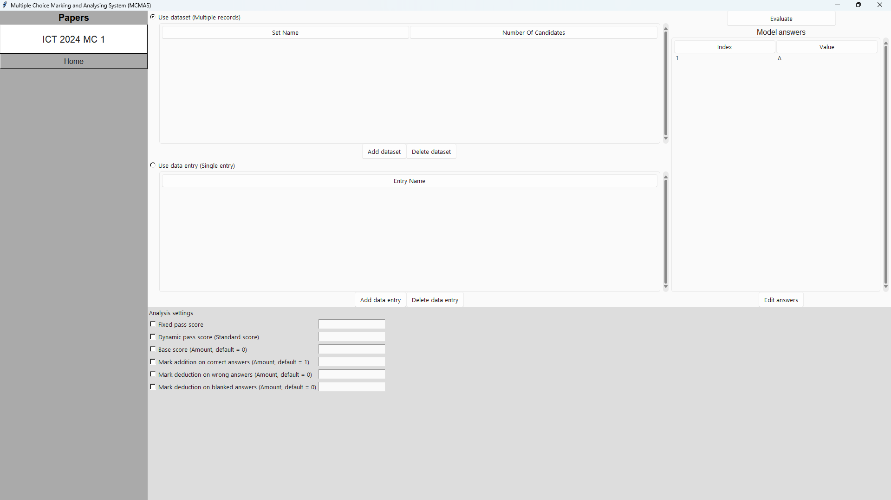
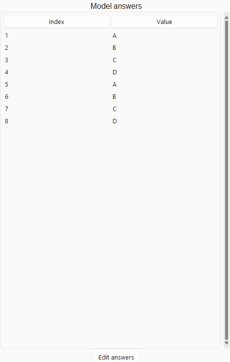

# 1. Overview
This report is to evaluate the development process of \"GUI MCMAS\", a python project created by LEE Ho Ming for the purpose of ICT School Based Assessment. The report will be divided into two main parts, namely **\"Design and Implementation\"** and **\"Testing and Evaluation\"**. The former is focused on the theoretical idea behind the app's (later often referred to as program's) design while the latter is focused on the implementation of the idea using computer code.

# 2. System Design
## 2.1 Requirements Analysis
The purpose of an MCMAS is, as quoted: 
> The MCMAS is an analysis tool used by teachers to mark multiple choice answer sheets and generate statistical information.

By automating the answer-marking and grading process, the MCMAS significantly reduces the time and effort teachers spend on evaluating students reponses. In addition to its primary function of marking, the system should also be designed to generate comprehensive statistical information, providing insights into student performance and question efficacy.


## 2.2 Objective
The objective is to create an app that, when given a set of multiple-choice model answers and multiple (or single) entries of candidate’s work, marks all candidates’ work according to the model answer and provides graphs and analytics on individual and overall performance of candidates. The app also stores marked results into an SQL database, which can be queried and exported within the app. All functions in the app are controlled by a windowed GUI, which is compatible with modern Windows systems. The app is intended to be used by public examiners and school teachers, and is expected to handle a large amount of entries on a long multiple-choice exam. Overall, the app is designed to streamline the marking and grading process, making it efficient and user-friendly for educators and providing a convenient environment for educators to gain insights on the performance of students. The app often will be referred to as **GUI MCMAS** in the following sections.

## 2.3 System Architecture
The GUI MCMAS is an offline GUI app, where the client interacts with the **backend evaluation function** through the **frontend GUI app** constructed with **tkinter**. This architecture allows a **friendly user experience** and **easy navigation** between different features and modes of the application, enabling users to **achieve the goal** of evaluating multiple choice tests with **minimal effort**.

According to GitHub Repository analysis, the app consists of **85.4% Python program** while the rest is `.tcl` format files. The `.tcl` files stores the **format styles for custom ttk widgets** while the **Python** code is the **main and only programming language used**.

The reasons the Python Language is used are as follow:
- **Cross\-Platform Compatibility**: - Python can be executed **across different operating systems**, and is **native to most Linux distributions**.
- **Ease of Development** - Python has a **simple** and **readable syntax**, making it **accessible** for most people and allowing a **rapid development**.
- **Rich Libraries** - Python **supports various libraries** for different functionalities, including GUI development.

### 2.3.1 Usage of Third-Party Libraries
In the development of GUI MCMAS, several third-party libraries have been used to simplify operations and enable more advanced features. Here is a list of every used library.

- **Tkinter** - A standard Python GUI Library that provides functions to create widgets and windows. It serves as a building foundation of the GUI.
- **ThemedTK** - Also known as `ttk`, it adds the ability to customize themes and styles of Tkinter widgets, improving the GUI accessibility and making it look more modern.
- **TKinterModernThemes** - An addon to Tkinter and ThemedTKinter, adding more modernized Windows 11 style custom widgets and custom themes.
- **os** - Provides functions for interacting with the operating system, such as scanning directories, and joining paths.
- **shutil** - Stands for "Shell utilities". Provides functions for directory and files operation.
- **re** - A built-in module that provides regular expression support. Mainly used to detect if user input matches any invalid characters.
- **uuid** - Used to generate universally unique identifiers which serves as names for temporary folders.
- **datetime** - A built-in library that gives a combination of date and time recorded by the machine. Used for naming SQL tables.
- **pandas** - A library used for working with datasets. Mainly used for the evaluation of candidate answers datasets.
- **csv** - An easy way to support csv format files. Used to read and write answer files.
- **sqlite3** - A library used to work with sql database. Allows the creation, querying, edting of database.


## 2.4 Application Features
This section outlines the **desired functions and features** the app should incorporate. These functionalities will be integrated into the GUI and can be controlled by users.

### 2.4.1 Evaluation Modes
The main purpose of GUI MCMAS is to evaluate the performance score of candidates. To optimize user-experience, the app is supports the evaluation of a **single candidate's** answers and **a batch of candidates'** answers by switching between `Data Entry mode` and `Dataset mode`.


In `Data Entry mode`, the app suppports the following analysis functions:
- Candidate's score
- Maximum attainable score
- No. of correct/wrong/blanked answers
- Comparison between candidate's answer and model answer
- Whether candidate passed


This mode aims to evaluate a single candidate's test performance as an **isolated event**. It treats each candidate's performance as an **individual record** with **no relation** between each other.

In `Dataset mode`, the app supports the following analysis functions:
- Every candidates' scores
- Number of correct/wrong/blanked answers
- Maximum attainable score
- Standard score of each candidate
- Passing rate
- Best/worst performing candidates and their corresponding scores

This mode aims to evaluate a group of candidates' test performance and make comparison between them. 

### 2.4.2 Evaluation Settings
The app offers various settings for evaluating candidates' responses, providing enhanced **flexibility**. Each setting is shown as a **check box**, with its corresponding **value input box** next to it. The settings item and their description are as follow:

#### **Fixed Passing Score**
Sets a **fixed passing score** for evaluation. Candidates obtaining a score **higher or equal to** the fixed passing score will be designated as "passed".

This feature is useful when the passing score **is not exactly half** of the full score. In that case, users can enable this setting and set the desired passing score. Note that the passing score should be entered as **an absolute value** rather than **a percentage of the total score**. 

Also note that this setting cannot be enabled together with `Dynamic Passing Score`. More information about that feature below. By default, the fixed passing score is set to be **half of the highest attainable score**, when neither `Fixed Passing Score` nor `Dynamic Passing Score` is enabled.

#### **Dynamic Passing Score**
Sets a **Dynamic Passing Score**. Candidates obtaining a **standard score** higher than or equal to said passing score. 

This feature is used when the user wants to retrieve **a certain percentage of top performing students**. Public exams and open competitions typically assign grades by a fixed percentage of the highest-performing candidates, such as obtaining 5\** in HKDSE.

This feature cannot be enabled together with `Fixed Passing Score`. This feature is also **not available** when evaluating in `Data Entry Mode`. Note that the `Passed` attribute will refer to the dynamic passing score once this setting is enabled. 

#### **Base Score**
Sets a **base score** as the **starting score** when calculating candidates' performance. 

This feature is useful when user wishes to set a **starting score** for candidates. When configured correctly, this can ensure that the candidates' score does not reach below or above a certain point (does not reach below zero) when using **score subtraction** functions, ensuring the full control of score evaluation flexibilty.

The **base score** and other **custom score evaluation settings** will be taken into account when calculating standard score.

#### **Correct Answer Score**
Sets the score a candidate obtains when **a correct answer is evaluated**. The default correct answer score is set to 1.

#### **Wrong Answer Score**
Sets the score that is subtracted when **a wrong answer is evaluated**. Note that a **blanked answer** is **NOT a wrong answer**. The default wrong answer score is set to 0.

#### **Blanked Answer Score**
Sets the score that is subtracted when **a blanked answer is evaluated**. Note that only a **space** `" "` is counted as a blanked answer. The default blanked answer score is set to 0.

### 2.4.3 Model Answers
Multiple sets of model answers can be saved inside the app at the same time. Each set of model answers are referred to as **"Papers"** inside the app. Each paper must have at least one answer inside. Otherwise, it cannot be created. 

#### **Importing Model Answers from Files**
One of the ways to create a paper is to import model answers from a `.csv` file. The `.csv` file must follow a distinct format in order to be imported correctly. `.csv` files are widely used for data exchange between applications, and can be edited by most spreadsheet softwares such as Microsoft Excel. 

#### **Creating Model Answers**
Considering that not all users know how to edit `.csv` files to exactly match the distinct format, the app also supports creating a set of model answers within the app itself using GUI windows. The user is able to **add**, **edit**, and **delete** each answer using GUI buttons. To ensure a swift creation process, shortcuts for said functions are also available.

#### **Remarks for Each Model Answer**
To assure crystal **clarification** and clear **recording keeping**, the app allows users to **mark remarks next to each question's answer**. The remarks can also be **edited** or **deleted** together with the answer value itself.

Please note that remarks do not impact the evaluation of answers; they are provided solely to enhance clarity and ensure thorough explanations.

### 2.4.4 SQL Database Support
To establish **modularity** and **flexibility**, all evaluated results can be **exported into an SQL database table**. Each created paper holds **its own table**, and each evaluated result is **stored in a new table**. The app supports the essential features for **querying the databases** and has the option to **switch between databases**. Queried SQL results can also be **exported in the form of a `.csv` file**, which can be **further analyzed** by other data analytics software or stored by the user as a record.

## 2.5 GUI Design
This section is dedicated to the **design of the Graphical User Interface (GUI)**, focusing on its layout, visual elements, and user interactions. We will analyze the **choice of colors**, **fonts**, and **widget size**, as well as the **overall navigation flow**, to ensure a cohesive and user-friendly experience. Furthermore, this section will evaluate how these design choices **support the application’s objectives** and **enhance its overall functionality**.

### 2.5.1 Interface Style
The app uses the light version of `sun-valley` from **TKinterModernThemes**. 

Image source: https://github.com/RobertJN64/TKinterModernThemes

This theme is designed to look simple and clean, while referencing widget designs from User Interface of Microsoft Windows 11. 

#### **Color Choices**
A simple **white and light gray** color palette is used throughout the app to present the **clarity** of this powerful tool application. There is often **a blue accent color** for selected options to **catch the users' attention**. 

#### **Font Choices**


The majority of the app uses the font `Helvetica`. It presents a **simple and clear** style, which fits this app's purpose. Throughout the app, different texts are presented with **different font sizes**, with page titles being **bold**.


#### **The Main Window Structure**
The GUI MCMAS main window is a maximized full screen application. Most of its features can be found on this window.The main window is divided into 3 main parts: **the upper panel**, **the lower panel**, and **the sidebar**. They are separated by their difference in colors.


The window in home page.


The window in a workspace.


##### **The Upper Panel**
The upper panel takes up **the most space on the screen**. It shows **most of the elements** of the app. Users are expected to **spend most of their time** in this panel. To balance the app's color theme, the upper panel has a **white** background color. 

##### **The Lower Panel**
The lower panel has the same width as the upper panel, but is shorter than the upper panel. It mainly **shows optional settings** that users can enable. Being the second-largest part of the main window, it has a **light-gray** color.

##### **The Sidebar**
The sidebar is located on the **left**, which shows **navigation buttons** leading to the **home screen** and **different saved papers**. It is the smallest part of the main window, and has the darkest gray color. When a paper is selected, the corresponding button will "**light up**" by **turning white** to **indicate that the user is working on that specific paper**.

### 2.5.2 Elements and Pages
The GUI MCMAS is constructed with different custom made GUI elements. In this section, we will explore each significant element and widget, their design choices and their expected usage.
#### **The Home Page**


The Home Page is the first page a user will see when opening the app. It serves as a page to greet the user, and central hub that provides them with all the available options or buttons leading to different parts of the app.

This page is constructed with 3 parts: **the title**, **the start buttons**, and **the guide buttons (walkthrough)**
##### **The Title**


The title section has 3 text elements: the title itself, a tagline, and a instruction description. Their text font sizes designed in descending order so that the user will first be greeted with the app's main title, then its tagline, and finally the instruction. This gives a clear the user a clear idea of what they will expect when using this app and how to start using it.

##### **The Start Buttons**


The start buttons has its own title, and a list of buttons that leads to different functions of the app. The title is in bold blank font, while the buttons are texts with blue accent color. This indicates that the text buttons are functional when clicked. The blue color also adds some levels of highlight to the dullness of a full black-and-white home screen. The order of the buttons are based on the expected frequency of usage of each button in descending order, namely **"Create a new paper..."**, **"Import a new paper..."**, **"Open database manager.."**, and **"About this app"**. The three dots `...` also hints that those buttons will lead the user to a different page/window.

##### **The Guide Buttons (Walkthrough)**


The design of this section is similar to the start buttons. The two buttons leads to tutorial documents that teaches user how to use the app.

#### **The Workspace**
The workspace is a feature-dense page where users are expected to spend more time in. It consists of three panels: **Data Selection Panel**, **Answer Preview Panel**, and **Action Button Panel**. 


##### **Data Selection Panel**
This panel takes up the most space in the workspace. It is divided into the **dataset** section and **data entry** section. 


The data selection panels.

On top of each section is a radio button that selects the **evaluation mode**. The system will only determine the selection options on the **enabled mode**. (E.g.. if dataset mode is selected, the system will only determine selections on the dataset panel)


The data evaluation mode button.

Below the mode selection button is a list of saved data entry/set. Clicking on the **radio button** next to an entry/set will select the corresponding entry/set for evaluation. Clicking on the names of the entry/set itself will select it for further options.


The dataset list.

Below the list are the **add button** and **delete button**. Clicking on the the **add button** launches a file search pop up, where users can navigate and select the targeted candidates' answer file. Clicking on **the set/entry name** and then click on the **delete button** will **delete the selected set/entry from the list** but not from its original location.

##### **Answer Preview Panel**
The preview list is a **scrollable table** that shows the **saved model answers** of the current paper. It shows both the question number and the answer value of each question.



The answer preview list

Below the list is an **edit answer button** which takes the user to the edit model answer window.

#### **Create/Edit Model Answer Window**
The create model answer window is visually very similar to the edit model answer window. Therefore, this section is the combined description of both of them.


The Create Paper Window

The create/edit model answer window is a **separate pop-up window** from the MCMAS main window. It consists of a **paper name input**, **an answer list**, and some **function buttons**.

##### **Paper Name Input**


A simple text input with description above the input box. It must be filled in by users in order to create the paper. Note that the **edit** model answer window does not have this input box. The paper name **cannot** be changed once created.

##### **Answer List**
This list shows the real-time changes on the created/edit answers. It shows each answer's **value** and their corresponding **remarks**. Clicking on any **row** can select the specific answer for further actions.


This is the answer list. Question 3 is selected.

##### **Function Buttons**
There are 4 function buttons, namely **Add Answer**, **Edit Answer**, **Delete Answer**, and **Done**. They are positioned on the right lower corner of the window and is expected to be clicked freequently.

##### **Add Answer Popup**
Pressing **Add Answer** launches a separate top-level pop-up window. This is a simple window which allows users to enter a new answer that needs to be created. Additionally, the user can leave remarks for the answer. Note that the answer value must not be blank.


The Add Answer Window

##### **Edit Answer Popup**
Pressing **Edit Answer** launches another top-level pop-up window. This is visually similar to the Add Answer Popup. Note that an error will occur when no answers is selected but the Edit Answer button is pressed.


The Edit Answer Window

##### **Deleting Answers**
Selecting an answer and pressing **Delete Answer** will delete the corresponding answer. Pressing the button without the selecting any answers will result in an error. 

##### **Done Button**
The **Done Button** will submit the created/edited model answers to the system. In the create model answer window, it will automatically take the user to the created workspace. Note that if the **Paper Name** or the **Model Answers** is empty, an error will occur.

##### **Keyboard Shortcuts**
To ensure a swift creation process, shortcuts are created for frequently used functions.

| Shortcut | Action                           |
|----------|----------------------------------|
| Ctrl+N   | Presses the Add Answer Button    |
| Ctrl+E   | Presses the Edit Answer Button   |
| Del      | Presses the Delete Answer Button |
| Enter    | Presses Confirm or Done          |

A brief text instructions of the keyboard shortcuts are shown above the function buttons so users can learn about them when pressing the buttons.

#### **Import Paper Window**
Pressing "**Import a new paper...**" from home page takes the user to the following window.


Import Paper Window

The preview table on the left shows a preview of the answer file. To select a file, press "**Browse..**", which takes the user to an answer selection window. Alternatively, the user can paste the path of the file to the second text input box.

Upon pressing **Confirm**, the user is taken to the newly created workspace. An error will occur if the following happens:
- Paper Name is blank
- No file selected
- Invalid file selected

The system will not create a workspace if any error occurs.

#### **Data Entry Performance Window**
This window is shown after evaluation is done on a data entry. It compares the **candidate's answers** to the **model answer**. It also shows the **number of evaluated questions**, **number of correct/wrong/blank answers**, and **whether the candidate passed**.


The comparison table is **scrollable** when there are more answers that cannot be shown with the current size of table.

#### **Dataset Performance Window**
This window is shown after evaluation is done on a dataset. Compared to the data entry window, it is more **informative**. The upper table is a scrollable table that shows **Candidate ID**, **Candidate Name**, **Number of Correct/Wrong/Blanked Answer**, **Evaluated Score**, **Maximum Attainable Score**, **Standard Score**, and **Whether the candidate passed**. 


**Clicking** on any category's name will **sort the table** according to that category in ascending/descending order (Click again for descending).

#### **SQL Editor**
The SQL Editor is another window that allows users to query SQL Database, and export results as CSV. It supports the basic functions of an SQL database.


### 2.5.3 Navigation Structure
This is a GUI navigation diagram of the GUI MCMAS app.\


Most pages and windows are designed so that the user can navigate to any other pages at any given point. The navigation map is easy to understand even for first-time users.

# 3. Feature Implementation
This section is about how to use program to implement the system design mentioned above. GUI MCMAS is written in an object oriented python program. We will analyze each class, objects, methods, and global variables.
## 3.1 Program File Structure
The GUI MCMAS program consists of two python files: `ui.py` and `utils.py`. `ui.py` is the executed python file, and `utils.py` must be put in the same directory as `ui.py` to function properly. `ui.py` contains all codes that creates the GUI of the app, with some logical function that makes the GUI works properly. `utils.py` are additional backend functions that mainly handles the evaluation process of answers and file access procedures.

## 3.2 Evaluation Functions
This section is dedicated to the content of `utils.py`. `utils.py` holds **20 functions** that serves the following purposes:
- **Directory Management** - Converts directory to the location of the executable or script. This facilitates possibility of running the program as an executable.
- **File Validation and Reading** - Reads/previews files and validate the integrity and format of files.
- **Listing Files** - Lists all the file names inside a directory.
- **Answer Evaluation** - Evaluates candidates' answers with different modes and different requirements.
- **Scoring and Statistics** - Calculates the score and performance of statistics according to the user's requirements.

We will analyze each function in details, including how they function, their purpose, and different algorithms used.

### 3.2.1 `set_current_directory_to_executable()`
This function detects whether the user is running the program as a **python script** file, or an **executable**. If it is the former, it sets the os path **to the script directory's absolute path**. Otherwise, it sets the system path **to the absolute path of the executable file**.
- `os.path.dirname()` is used to get the directory path of a specific path.
- `os.chdir()` changes the **current working directory** to the specified path. All relative paths and files will follow the **new working directory**.
- Code:
    ```python
    def set_current_directory_to_executable():
        """Set the current working directory to the directory of the executable."""
        if getattr(sys, 'frozen', False):
            # Running as an executable
            exe_path = os.path.dirname(sys.executable)
            os.chdir(exe_path)
        else:
            # Running as a script
            script_path = os.path.dirname(os.path.abspath(__file__))
            os.chdir(script_path)
    ```

### 3.2.2 `validate_set_file(workspace,path)`
This function **validates a candidates' answers dataset file**. It first checks if the **file extension** is `.csv`. Assuming that the file format is is correct, the program tries to read the file if it is a csv file. Then, it checks whether **each candidate** has the **same number of answers** as the **model answer**. If all these validation passes, it returns `True`. Otheriwse, it either raises exceptions or returns `False`.
- `os.path.splittext(path)` return an a python `list` containing the **"root"** and the **"ext"** of a pathname. "root" contains the **filename without the extension** while "ext" is the **file extension**, including the dot ("`.`").
- `pd.read_csv(file)` is a method from the `pandas` library that **reads csv files** and turn them into Pandas DataFrame.
- `df.to_list` converts any Pandas DataFrame `df` into a python `list`.
- Code:
    ```python
    def validate_set_file(workspace,path):
        file_ext = os.path.splitext(path)[1]
        if file_ext == ".csv":
            ans_df = pd.read_csv(path)
            content = [ans_df[column].tolist() for column in ans_df]
            print(content[2])
            max_length = len(prev_read_ans(f"data/{workspace}/ans.csv")[1])
            for item in content[2]:
                if len(item) > max_length:
                    return False
        else:
            return False
        return True
            
    ```

### 3.2.3 `prev_read_ans(path)`
`prev_read_ans(path)` is a function that returns **a list of answers** from an existing model answer file. It returns an **empty list** `[]` if the specified file is not a `.csv` file. It raises exceptions when the specified csv file does not have a valid format.
- `pd.read_csv(file)` is a method from the `pandas` library that **reads csv files** and turn them into Pandas DataFrame.
- `df.to_list` converts any Pandas DataFrame `df` into a python `list`.
- Code:
    ```python
    def prev_read_ans(path):
        file_ext = os.path.splitext(path)[1]
        if file_ext == ".csv":
            ans_df = pd.read_csv(path)
            # print(ans_df.head())
            return [ans_df[column].tolist() for column in ans_df]
        return []
    ```

### 3.2.4 `prev_workspace_can_ans_set(workspace_name,set_name)`
This function returns a list of **answers from a candidates' answer dataset**. It assumes that the specified file has a **valid format**. 
- `pd.read_csv(file)` is a method from the `pandas` library that **reads csv files** and turn them into Pandas DataFrame.
- `df.to_list` converts any Pandas DataFrame `df` into a python `list`.
- Code:
    ```python
    def prev_workspace_can_ans_set(workspace_name,set_name):
        path = f"data/{workspace_name}/can_ans_set/{set_name}.csv"
        ans_df = pd.read_csv(path)
        return [ans_df[column].tolist() for column in ans_df]
    ```

### 3.2.5 `prev_workspace_can_ans_entry(workspace_name,entry_name)`
This function returns a list of **answers from a candidate's answer entry**. 
- `open(file,"r")` is used to open the file.
- `f.readlines()` returns a list containing every line in the file
- A for loop is used to **concatenate the first character of each line** to generate a model answer string.
- Code:
    ```python
    def prev_workspace_can_ans_entry(workspace_name,entry_name):
        path = f"data/{workspace_name}/can_ans/{entry_name}.txt"
        f = open(path,"r")
        ans = ""
        for text in f.readlines():
            ans = ans+text[0]
        return ans
    ```

### 3.2.6 `list_can_ans_set(workspace_name)`
This function **lists all answer datasets** in a workspace. It goes through every file in `data/<workspace_name>/can_ans_set` and returns the name of it if the file extension is `.csv`.
- `os.path.exists(directory)` determines whether the **specified directory exists**. This **avoids unnecessary checks and possible errors** if the directory does not exist.
- `os.listdir(path)` lists every directory or file inside the specific destination. `not os.path.isdir(os.path.join(directory,item))` ensures that `item` is not referring to a destination but a file.
- `os.path.splitext(item)[0]` makes sure only the file name, without the file extension is appended into the list.
- Code:
    ```python
    def list_can_ans_set(workspace_name):
        directory = f"data/{workspace_name}/can_ans_set"

        folders = []
        if os.path.exists(directory):
            for item in os.listdir(directory):
                # print(item)
                if not os.path.isdir(os.path.join(directory,item)):
                    if os.path.splitext(item)[1] == ".csv":
                        folders.append(os.path.splitext(item)[0])
        return folders
    ```

### 3.2.7 `list_can_ans(workspace_name)`
This function lists all **candidates' answer entry** in a workspace. It is very similar to `list_can_ans_set(workspace_name)`.
- Code:
    ```python
    def list_can_ans(workspace_name):
        directory = f"data/{workspace_name}/can_ans"
        folders = []
        if os.path.exists(directory):
            for item in os.listdir(directory):
                if not os.path.isdir(os.path.join(directory,item)):
                    if os.path.splitext(item)[1] == ".txt":
                        folders.append(os.path.splitext(item)[0])
        return folders
    ```

### 3.2.8 `evaluate_candidate_answers(workspace,ans_name,starting_score,correct_score,blank_deduction,wrong_deduction)` (DEPRECATED)
This is a deprecated function that takes in all requirements by the user, and **evaluates the score** of a single candidate in **data entry mode**. This function is deprecated and is not used anymore.
> This function is deprecated because it is more convenient to calculate necessary statistics in `DataEntryPerformancePopup.populate_table()` in `ui.py`. Nevertheless, it reflects the initial approach to evaluate the answers.

- Here is a flowchart of the function's logic:

- Code:
    ```python
    def evaluate_candidate_answers(workspace,ans_name,starting_score,correct_score,blank_deduction,wrong_deduction):
        ans_key,remarks = read_workspace_ans(workspace)
        can_ans_file = open(f"data/{workspace}/can_ans/{ans_name}.txt")
        can_ans = can_ans_file.readlines()
        for index in range(len(can_ans)):
            can_ans[index] = can_ans[index][0]
        result = []
        for index in range(len(can_ans)):
            if can_ans[index]==" ":
                result.append(" ")
            else:
                result.append(ans_key[index]==can_ans[index])
        return (result,score_calculator(result,starting_score,correct_score,blank_deduction,wrong_deduction))
    ```

### 3.2.9 `evaluate_dataset_answers(workspace,set_name,starting_score,correct_score,blank_deduction,wrong_deduction)`
This function takles in all requirements by the user, and **evaluates the score** of all candidates in a dataset.

- Here is a flowchart of the function's logic:


- Code:
    ```python
    def evaluate_dataset_answers(workspace,set_name,starting_score,correct_score,blank_deduction,wrong_deduction):
        ans_key,remarks = read_workspace_ans(workspace)
        can_id_set, can_name_set, can_ans_set = prev_workspace_can_ans_set(workspace,set_name)
        result_set = []
        index = 0
        for can_ans in can_ans_set:
            temp = []
            for i in range(len(can_ans)):
                if can_ans[i]==" ":
                    temp.append(" ")
                else:
                    temp.append(ans_key[i] == can_ans[i])
            result_set.append([can_id_set[index],can_name_set[index],temp,score_calculator(temp,starting_score,correct_score,blank_deduction,wrong_deduction),can_ans])
            index = index + 1
        std_scores = get_standard_score(result_set)
        for index in range(len(result_set)):
            result_set[index].append(std_scores[index])
        return result_set
    ```

### 3.2.10 `evaluate_entry_answers(workspace,entry_name,starting_score,correct_score,blank_deduction,wrong_deduction)`
This function **evaluates the answers** of a data entry.
- Here is a flowchart of the function's logic:

- `enumerate(can_ans)` adds a couner to iterable `can_ans`. This means it returns `[(0,can_ans[0]),(1,can_ans[1]),(2,can_ans[2]),...]`.
- Code:
    ```python
    def evaluate_entry_answers(workspace,entry_name,starting_score,correct_score,blank_deduction,wrong_deduction):
        ans_key,remarks = read_workspace_ans(workspace)
        can_ans = prev_workspace_can_ans_entry(workspace,entry_name)
        result = []
        for i,ans in enumerate(can_ans):
            if ans == " ":
                result.append(" ")
            else:
                result.append(ans==ans_key[i])
        return result
    ```


### 3.2.11 `score_calculator(result,starting_score,correct_score,blank_deduction,wrong_deduction)`
This is a function that **calculates the score** of a candidate based on the **evaluated result** of each question and the **requirements** provided by the user.
- Here is a flowchart of the function's logic:

- Code:
    ```python
    def score_calculator(result,starting_score,correct_score,blank_deduction,wrong_deduction):
        score = starting_score
        for item in result:
            if item == " ":
                score = score - blank_deduction
            elif item == True:
                score = score + correct_score
            else:
                score = score - wrong_deduction
        return score
    ```

### 3.2.12 `get_max_attainable_score(workspace,starting_score,correct_score,blank_deduction,wrong_deduction)`
This function **calculates the maximum attainable score** based on the user's requirement and the number of questions.
- Code:
    ```python
    def get_max_attainable_score(workspace,starting_score,correct_score,blank_deduction,wrong_deduction):
        ans = prev_read_ans(f"data/{workspace}/ans.csv")
        return score_calculator([True]*len(ans[0]),starting_score,correct_score,blank_deduction,wrong_deduction)

    ```

### 3.2.13 `get_mean_score(result_set)`
This function calculates the **mean score** among the entire dataset. It takes all candidates' score as input and calculate the mean score.
- Here is a flowchart of the function's logic:

- Code:
    ```python
    def get_mean_score(result_set):
        score = 0
        for question_count,result in enumerate(result_set):
            score = score + result[3]
        return score/(question_count+1)
    ```

### 3.2.14 `get_standard_deviation(result_set)`
This function calculates the **standard deviation** of the dataset, so that a **standard score** can be generated for each candidate.
- `np.std(scores,ddof=0)` is used to calculated the standard deviation. Note that `np` is the abbreivation of `numpy`. `np.std()` is a function that calculates the standard deviation with any given dataset.
- Code:
    ```python
    def get_standard_deviation(result_set):
        scores = []
        for result in result_set:
            scores.append(result[3])
        return np.std(scores,ddof=0)
    ```

### 3.2.15 `get_correct_percentage_graph(result_set)`
This function **generates a bar chart** that shows the **percentage of correct answers on each question**. It returns a `matplotlib.plyplot` (abb. as `plt`) graph, which can be plotted by calling `fig.plot()`.
- Code:
    ```python
    def get_correct_percentage_graph(result_set):
        
        question_count = len(result_set[0][2])
        
        # Initialize zero arrays so multiple questions can be processed at once
        correct_counts = np.zeros(question_count)
        total_counts = np.zeros(question_count)
        
        # We only care whether candidates got questions correct
        for _,_,answers,_,_,_ in result_set:
            for i, answer in enumerate(answers):
                print(i,answer)
                if answer == True and answer != " ":
                    correct_counts[i] += 1
                total_counts[i] += 1
        
        print(correct_counts)
        print(total_counts)
        percentages = (correct_counts/total_counts) * 100
        # Handles zero division case
        percentages = np.nan_to_num(percentages)
        
        # Generate graph
        fig, ax = plt.subplots(figsize=(10, 6))
        ax.bar(range(question_count), percentages, color='skyblue')
        ax.set_xticks(range(question_count))
        ax.set_xticklabels([f'Q{i+1}' for i in range(question_count)])
        ax.set_ylabel('Percentage of Correct Answers (%)')
        ax.set_title("Candidates' performance on individual question")
        ax.set_ylim(0, 100)  # Set y-axis limits from 0 to 100%
        ax.grid(axis='y')

        return fig  # Return the Figure object
    ```


## 3.3 GUI Classes and Function
This section is dedicated to the content of `ui.py`. `ui.py` contains a total of **98 defined functions**, across **11 different main classes**. These classes divides the functions and objects into different categories, for better readability and ease of future development.


### App Class

- **MCMASApp**
    - An object that creates the main window for the application, managing the layout and functionality of the user interface.
    - Methods:

        - `__init__(self, root)`
            - Initializes this object by setting up the main application window, configuring the layout, and creating the left and right panels for navigation and content display.
            

        - `update_frame(self, upper_panel, lower_panel)`
            - Updates the content of the upper and lower panels by removing existing widgets and inserting new content, allowing dynamic changes in the interface.
            

        - `update_sidebar(self)`
            - Refreshes the sidebar to reflect the current list of available workspaces, ensuring that the user can easily navigate between different projects.
            

        - `highlight_sidebar_button(self, workspace_name)`
            - Highlights the sidebar button corresponding to the specified workspace name, providing visual feedback to the user on their current selection.
            

### Layout Classes

- **AppMainLayout**
    - Defines the default layout of the application, including the left and right panels, providing a structure for content presentation.

    - **RightPanel**
        - Methods:

            - `__init__(self, parent)`
                - Initializes the right panel frame that will hold the main content of the application, setting up space for the upper and lower sections.
                

            - `update_upper_panel(self, new_content)`
                - Replaces the content of the upper panel with new content provided, allowing for changes in the displayed information.
                

            - `update_lower_panel(self, new_content)`
                - Similar to `update_upper_panel`, this method changes the content of the lower panel based on new data or interface needs.
                

    - **LeftPanel**

        - Methods:

            - `__init__(self, parent)`
                - Initializes the left panel frame, setting up the sidebar with workspace buttons for navigation.
                

            - `create_buttons(self)`
                - Generates buttons for each workspace available, allowing users to easily switch between different projects.
                

            - `update_workspaces(self, new_workspaces)`
                - Updates the sidebar buttons based on a new list of workspaces, refreshing the UI to reflect any changes.
                

            - `on_workspace_click(self, workspace)`
                - Handles user interaction when a workspace button is clicked, triggering the initialization of that specific workspace.
                

            - `on_button_press(self, button)`
                - Manages the visual state of buttons in the sidebar when pressed, providing feedback by highlighting the active button.
                

            - `press_button_with_text(self, button_text)`
                - Searches for a button with the specified text and highlights it, indicating the currently active workspace.
                

### Welcome Screen Class

- **Welcome**

    - **WelcomeWorkspace**

        - Methods:

            - `__init__(self, parent)`
                - Initializes the welcome workspace panel, which serves as the entry point to the application.
                

            - `setup_layout(self)`
                - Organizes the layout of the welcome screen, including titles, descriptions, and buttons for navigation.
                

            - `create_frame_with_title(self, main_text, sub_text, description)`
                - Constructs a frame that displays a main title, subtitle, and descriptive text to guide the user.
                

            - `create_quickstart_frame(self)`
                - Creates a frame containing quick start buttons for common actions, facilitating immediate user engagement.
                

            - `create_walkthrough_frame(self)`
                - Sets up a frame with buttons that provide walkthrough options to assist users in navigating the application.
                

    - **WelcomeButton**

        - Methods:

            - `__init__(self, parent, buttontext, command)`
                - Initializes a button with specified text and a command to be executed when clicked, allowing for customized actions.
                
### Marker Class

- **Marker**

    - **Workspace**

        - Methods:

            - `__init__(self, parent)`
                - Initializes the workspace for marking, setting up the layout and components needed for answer evaluation.
                

            - `update_answer_table(self, content)`
                - Updates the answer table within the workspace with new content, reflecting the current answers and their states.
                

    - **AnswersTable**

        - Methods:

            - `__init__(self, master, max_rows=65536, values=[])`
                - Initializes the answers table, setting parameters such as maximum row count and initial answer values.
                

            - `create_widgets(self)`
                - Sets up the necessary widgets for the answers table, including buttons for editing and the table display itself.
                

            - `launch_edit_ans_win(self)`
                - Opens a popup window for editing answers, allowing users to modify existing entries.
                

            - `update_table(self, answers)`
                - Refreshes the content of the answers table with new answers, ensuring the UI reflects the current data.
                

    - **DataSelectionPanel**

        - Methods:

            - `__init__(self, parent)`
                - Initializes the data selection panel, providing options for users to choose between datasets or individual entries.
                

            - `set_data_mode(self, mode)`
                - Updates the current data mode (either "set" for multiple records or "entry" for a single entry) based on user selection.
                

            - `add_set_button_function(self)`
                - Handles the event triggered when a user attempts to add a dataset file, facilitating file selection and validation.
                

            - `del_set_button_function(self)`
                - Manages the deletion of a selected dataset, ensuring that the user confirms their action to prevent accidental loss.
                

            - `add_ans_button_function(self)`
                - Handles the addition of a new data entry file, allowing users to import individual records.
                

            - `del_ans_button_function(self)`
                - Manages the deletion of a selected data entry, similar to dataset deletion but for individual records.
                

            - `get_data_mode(self)`
                - Returns the current data mode, indicating whether the user is working with a dataset or a single entry.
                

    - **ActionsPanel**

        - Methods:

            - `__init__(self, parent)`
                - Initializes the actions panel with buttons for evaluating answers, providing direct functionality for users.
                

    - **Settings**

        - Methods:

            - `__init__(self, parent)`
                - Sets up the settings panel where users can adjust evaluation parameters.
                

            - `getObj(self)`
                - Returns all setting objects created in the settings panel, allowing access to current configurations.
                

    - **AnalysisSettingsPanel**

        - Methods:

            - `__init__(self, parent)`
                - Initializes the analysis settings panel with various scoring options for performance evaluation.
                

            - `getSettingsObjects(self)`
                - Collects and returns all settings objects created in the analysis settings section.
                

    - **EditAnsPopup**

        - Methods:

            - `__init__(self, workspace_name)`
                - Initializes the answer editing popup, linking it to the specified workspace for context.
                

            - `setup_ui(self)`
                - Constructs the user interface elements in the popup to facilitate answer editing.
                

            - `add_answer(self)`
                - Opens a dialog for adding a new answer, enabling user input for answer management.
                

            - `submit_answer(self, answer, remark, window)`
                - Validates and submits the new answer to the list, appending it to the existing entries.
                

            - `edit_answer(self)`
                - Opens a dialog for editing the currently selected answer, allowing modifications to be made.
                

            - `update_answer(self, index, answer, remark, window)`
                - Responsible for updating an existing answer at a specified index based on user inputs.
                

            - `delete_answer(self)`
                - Removes the selected answer from the list, updating the display to reflect this change.
                

            - `save_answers(self)`
                - Saves the list of answers to a file, persisting user changes.
                
### Import Paper Class

- **ImportPaper**

    - Methods:

        - `__init__(self)`
            - Initializes the import paper functionality, preparing the popup for user interaction.

        - `popup()`
            - Creates the popup window for importing a new paper, setting the required dimensions and properties.

        - `create_preview_block(content)`
            - Constructs a preview block within the popup to display the imported data before finalizing the import.

        - `create_settings_block(content, preview_block)`
            - Sets up the settings block where users can specify import options and view the preview.

        - `create_file_selection_block(settings_block, preview_block)`
            - Creates the file selection interface, allowing users to browse for and select a CSV file to import.

        - `browse_button_func(paper_path_entry, preview_block)`
            - Manages the file browsing action, updating the preview with the selected file's content.

        - `create_end_buttons(wrapper, paper_name_entry)`
            - Constructs the buttons for confirming or canceling the import operation, facilitating user actions.

        - `populate_preview(preview_block, answers)`
            - Fills the preview block with answers from the imported file, giving users a visual confirmation of their selection.

        - `confirm_function(paper_name, popup_window)`
            - Validates and processes the import confirmation, ensuring the new paper is created and saved properly.

### New Paper Class

- **NewPaperPopup**

    - Methods:

        - `__init__(self)`
            - Initializes the new paper popup window, preparing it for user input related to creating a new paper.

        - `setup_ui(self)`
            - Sets up the user interface elements within the popup, including input fields and buttons.

        - `add_answer(self)`
            - Opens a dialog to allow users to add a new answer to the paper.

        - `submit_answer(self, answer, remark, window)`
            - Validates and submits the new answer for inclusion in the list of answers.

        - `edit_answer(self)`
            - Opens a dialog for editing the selected answer, allowing modifications to be made.

        - `update_answer(self, index, answer, remark, window)`
            - Updates the answer at the specified index with new user-provided values.

        - `delete_answer(self)`
            - Deletes the currently selected answer from the list.

        - `validate_paper_name(self, paper_name)`
            - Ensures the paper name adheres to naming conventions and does not conflict with existing papers.

        - `save_answers(self)`
            - Saves the list of answers to a designated file, finalizing the creation of the new paper.

### Scrollable Table Class

- **ScrollableTable**

    - Methods:

        - `__init__(self, master, headers, data, height, width)`
            - Initializes the scrollable table with specified headers, data, height, and width, providing a dynamic display.

        - `setup_treeview(self, headers, data, height, width)`
            - Configures the treeview to present the data in a structured format, enabling scrolling for larger datasets.

        - `update_data(self, data)`
            - Updates the table's displayed data, reflecting changes in the underlying dataset.

### Popup Classes for Performance

- **DatasetPerformancePopup**

    - Methods:

        - `__init__(self, master, data)`
            - Initializes the dataset performance popup, creating the necessary elements to display performance metrics.

        - `populate_table(self, data)`
            - Fills in the performance metrics table with data, providing insights based on candidate evaluations.

        - `sort_column(self, col, reverse)`
            - Sorts the specified column in the performance table, enhancing data usability.

        - `get_sort_key(self, entry, col)`
            - Determines the appropriate key for sorting based on the specified column, allowing flexible data organization.

        - `adjust_font(self)`
            - Adjusts the font settings for better readability within the table.

        - `send_to_db(self)`
            - Handles the process of sending performance data to a SQL database, facilitating data persistence.

- **DataEntryPerformancePopup**

    - Methods:

        - `__init__(self, master, data)`
            - Initializes the data entry performance popup, setting up the interface for displaying candidate performance.

        - `populate_table(self, data)`
            - Populates the performance table with candidate data, summarizing their results.

### SQL Editor Class

- **SQLDatabaseEditor**

    - Methods:

        - `__init__(self, master=None, default_query="", default_db="")`
            - Initializes the SQL database editor popup with a specified query and database for user interaction.

        - `fetch_databases(self)`
            - Retrieves a list of available databases for the user to select from, enhancing functionality.

        - `execute_query(self)`
            - Executes the SQL query entered by the user and displays the results, enabling database interaction.

        - `export_to_csv(self)`
            - Facilitates exporting the results of the SQL query to a CSV file, allowing for data sharing and analysis.

### Utility Classes

- **PlaceHolderLowerRightPanel**

    - Methods:

        - `__init__(self, parent)`
            - Initializes a placeholder panel for the lower right corner of the home page, providing a visual structure.

- **AboutPopup**

    - Methods:

        - `__init__(self, master)`
            - Initializes the about popup window, presenting information about the application.

        - `create_widgets(self)`
            - Constructs the widgets for displaying the about information, including license details and version information.

- **PlaceHolderPopup**

    - Methods:
        - `__init__(self, master)`
            - Initializes a placeholder popup for features that are still in development, informing users of upcoming functionality.

### Exception Handler Class

- **TkExceptionHandler**

    - Methods:

        - `__init__(self, func, subst, widget)`
            - Initializes the exception handler, wrapping a specified function with a substitution mechanism for error handling.

        - `__call__(self, *args)`
            - Executes the wrapped function with provided arguments, applying any necessary substitutions to handle exceptions gracefully.


## 3.4 Variable Table
The following table lists and describe each global variable used inside the `ui.py` file.


<table>
    <thead>
        <tr>
            <th>Variable</th>
            <th>Description</th>
            <th>Association</th>
        </tr>
    </thead>
    <tbody>
        <tr>
            <td><code>current_workspace</code></td>
            <td>A <code>str</code> variable that stores the name of workspace that is currently opened. It stays blank when the user stays on homepage. This allows different methods and functions to easily identify the targeted workspace.</td>
            <td>
                <ul>
                    <li><code>set_current_directory_to_executable()</code></li>
                    <li><code>init_home_page()</code></li>
                    <li><code>init_workspace(workspace_name)</code></li>
                    <li><code>read_workspace_ans(workspace_name)</code></li>
                    <li><code>list_can_ans_set(current_workspace)</code></li>
                    <li><code>prev_workspace_can_ans_set(current_workspace, item)</code></li>
                    <li><code>evaluate_dataset_answers(current_workspace, gSetName.get(), ...)</code></li>
                    <li><code>evaluate_entry_answers(current_workspace, gEntryName.get(), ...)</code></li>
                </ul>
            </td>
        </tr>
        <tr>
            <td><code>data_mode</code> (deprecated)</td>
            <td>A deprecated <code>tk.StringVar</code> variable that stores the evaluation mode. A newer, more convenient method has replaced this one.</td>
            <td>
                <ul>
                    <li><code>master_evaluate()</code></li>
                    <li><code>get_data_mode()</code></li>
                    <li><code>set_data_mode(mode)</code></li>
                    <li><code>list_can_ans_set(current_workspace)</code></li>
                    <li><code>prev_workspace_can_ans_entry(current_workspace, gEntryName.get())</code></li>
                </ul>
            </td>
        </tr>
        <tr>
            <td><code>root</code></td>
            <td>A <code>TKMT.ThemedTKinterFrame</code> object that defines the main window.</td>
            <td>
                <ul>
                    <li><code>TKMT.ThemedTKinterFrame("MCMAS", "sun-valley", "light")</code></li>
                    <li><code>root.root.state("zoomed")</code></li>
                    <li><code>root.mainloop()</code></li>
                    <li><code>SQLDatabaseEditor(root.root, ...)</code></li>
                    <li><code>DatasetPerformancePopup(root.root, ...)</code></li>
                    <li><code>DataEntryPerformancePopup(root.root, ...)</code></li>
                    <li><code>AboutPopup(root.root)</code></li>
                </ul>
            </td>
        </tr>
        <tr>
            <td><code>app</code></td>
            <td>A <code>MCMASApp</code> custom object that inserts all elements of the main window into <code>root</code>.</td>
            <td>
                <ul>
                    <li><code>app.update_frame(...)</code></li>
                    <li><code>app.update_sidebar()</code></li>
                    <li><code>app.highlight_sidebar_button(workspace_name)</code></li>
                    <li><code>MCMASApp.__init__(root)</code></li>
                    <li><code>marker_workspace.update_answer_table(ans)</code></li>
                </ul>
            </td>
        </tr>
        <tr>
            <td><code>gSetName</code></td>
            <td>A <code>tk.StringVar</code> that stores the name of currently selected dataset.</td>
            <td>
                <ul>
                    <li><code>gSetName.get()</code></li>
                    <li><code>evaluate_dataset_answers(current_workspace, gSetName.get(), ...)</code></li>
                    <li><code>SQLDatabaseEditor(root.root, default_query=f"SELECT * FROM {table_name}", default_db=gSetName.get())</code></li>
                    <li><code>populate_table(data)</code></li>
                </ul>
            </td>
        </tr>
        <tr>
            <td><code>gEntryName</code></td>
            <td>A <code>tk.StringVar</code> that stores the name of currently selected data entry.</td>
            <td>
                <ul>
                    <li><code>gEntryName.get()</code></li>
                    <li><code>prev_workspace_can_ans_entry(current_workspace, gEntryName.get())</code></li>
                    <li><code>evaluate_entry_answers(current_workspace, gEntryName.get(), ...)</code></li>
                    <li><code>DataEntryPerformancePopup(master, data)</code></li>
                </ul>
            </td>
        </tr>
        <tr>
            <td><code>gSettings</code></td>
            <td>
                A <code>dict</code> that stores the evaluation settings values and their enabled states. It includes the following keys:
                <ul>
                    <li><code>"fixed_pass"</code></li>
                    <li><code>"dynamic_pass"</code></li>
                    <li><code>"base_score"</code></li>
                    <li><code>"correct_ans_score"</code></li>
                    <li><code>"wrong_ans_deduction"</code></li>
                    <li><code>"blank_ans_deduction"</code></li>
                </ul>
                Inside each key is a sub-dictionary that includes the following:
                <ul>
                    <li><code>"Enabled"</code></li>
                    <li><code>"Value"</code></li>
                </ul>
            </td>
            <td>
                <ul>
                    <li><code>gSettings["fixed_pass"]["Enabled"].get()</code></li>
                    <li><code>gSettings["dynamic_pass"]["Enabled"].get()</code></li>
                    <li><code>gSettings["base_score"]["Enabled"].get()</code></li>
                    <li><code>gSettings["correct_ans_score"]["Enabled"].get()</code></li>
                    <li><code>gSettings["wrong_ans_deduction"]["Enabled"].get()</code></li>
                    <li><code>gSettings["blank_ans_deduction"]["Enabled"].get()</code></li>
                    <li><code>gSettings["dynamic_pass"]["Value"].get()</code></li>
                    <li><code>gSettings["fixed_pass"]["Value"].get()</code></li>
                </ul>
            </td>
        </tr>
    </tbody>
</table>

## 3.5 File Storage Architecture
This section is dedicated to the **way files are stored** inside the app.


# 4. Program Testing
This section is documents the **development process** of significant functions, including **testing** and **evaluation**.

## 4.1 `get_mean_score(result_set)`

```python
def get_mean_score(result_set):
    score = 0
    for question_count,result in enumerate(result_set):
        score = score + result[3]
    return score/(question_count+1)
```
This function calculates the **mean score** with a given results `list`. The function is tested in the following way:
1. Create a list of evaluated candidates' answers
2. Call this function and save its output into a variable `mean_score`
3. Print the variable `mean_score`

Since this function is in the `utils.py` file, which is **not executed directly** when the app runs, `if __name__ == "__main__":` can be used to differ whether the file is executed directly or not. When executed directly, it tests the function with the method mentioned above.

This snippet of code is appended at the bottom of `utils.py` temporarily for testing purposes, where `result` is the list of evaluated candidates' answer:
```python
if __name__ == "__main__":
    mean_score = get_mean_score(result)
    print(mean_score)
```

These are some sets of content of `result` for this test:
1. ```python
    [['1A01', 'Tom', [True, True, True, True, True, True, ' ', True], 7, 'ABCDAB D', 0.7071067811865469], 
    ['1A02', 'Paul', [True, True, True, True, ' ', True, True, True], 7, 'ABCD BCD', 0.7071067811865469], 
    ['1A03', 'Alex', [False, True, True, False, True, True, True, True], 6, 'CBCBABCD', -1.4142135623730956], 
    ['1A04', 'Mary', [False, True, ' ', True, True, True, True, True], 6, 'DB DABCD', -1.4142135623730956], 
    ['1A05', 'Bob', [False, True, True, True, True, True, True, True], 7, 'CBCDABCD', 0.7071067811865469], 
    ['1A06', 'Kay', [True, ' ', True, True, True, True, True, True], 7, 'A CDABCD', 0.7071067811865469]]
    ```
2. ```python
    [['1A01', 'Tom', [True, True, True, True, True, True, True, True], 8, 'ABCDABCD', 0.8944271909999164], 
    ['1A02', 'Paul', [True, True, True, True, True, True, True, True], 8, 'ABCDABCD', 0.8944271909999164],
    ['1A03', 'Alex', [False, True, True, False, True, True, True, True], 6, 'CBCBABCD', -1.7888543819998317], 
    ['1A04', 'Mary', [False, True, True, True, True, True, True, True], 7, 'DBCDABCD', -0.4472135954999576], 
    ['1A05', 'Bob', [False, True, True, True, True, True, True, True], 7, 'CBCDABCD', -0.4472135954999576], 
    ['1A06', 'Kay', [True, True, True, True, True, True, True, True], 8, 'ABCDABCD', 0.8944271909999164]]
    ```


Below is the comparison between the **expected result** and the **actual result**.
<table>
    <tr>
        <th>Testing Set Number</th>
        <th>Expected result</th>
        <th>Actual result</th>
    </tr>
    <tr>
        <td>1</td>
        <td>6.666666666666667</td>
        <td>6.666666666666667</td>
    </tr>
    <tr>
        <td>2</td>
        <td>7.333333333333333</td>
        <td>7.333333333333333</td>
    </tr>
</table>

## 4.2 `evaluate_dataset_answers(workspace,set_name,starting_score,correct_score,blank_deduction,wrong_deduction)`
```python
def evaluate_dataset_answers(workspace,set_name,starting_score,correct_score,blank_deduction,wrong_deduction):
    ans_key,remarks = read_workspace_ans(workspace)
    can_id_set, can_name_set, can_ans_set = prev_workspace_can_ans_set(workspace,set_name)
    result_set = []
    index = 0
    for can_ans in can_ans_set:
        temp = []
        for i in range(len(can_ans)):
            if can_ans[i]==" ":
                temp.append(" ")
            else:
                temp.append(ans_key[i] == can_ans[i])
        result_set.append([can_id_set[index],can_name_set[index],temp,score_calculator(temp,starting_score,correct_score,blank_deduction,wrong_deduction),can_ans])
        index = index + 1
    std_scores = get_standard_score(result_set)
    for index in range(len(result_set)):
        result_set[index].append(std_scores[index])
    return result_set
```
This is the master function that evaluates **all candidates' answers in a dataset**. It obtains data directly from the dataset directory. The following functions will also be tested when testing this function:
- `read_workspace_ans(workspace)` - Gets the model answer from the directory.
- `prev_workspace_can_ans_set(workspace,set_name)` - Gets the answer dataset from the directory.
- `score_calculator(result,starting_score,correct_score,blank_deduction,wrong_deduction)` - A function that calculates the performing score of each individual candidate.
- `get_standard_score(result_set)` - A function that calculates the standard score based on all candidates' scores.

To test each part thoroughly, this function is modified as follow to **print as much useful information as possible**:
```python
def evaluate_dataset_answers(workspace,set_name,starting_score,correct_score,blank_deduction,wrong_deduction):
    ans_key,remarks = read_workspace_ans(workspace)
    print(f"The model answer key is {ans_key}")
    can_id_set, can_name_set, can_ans_set = prev_workspace_can_ans_set(workspace,set_name)
    print(f"The candidate id, name, and answers are: {(can_id_set, can_name_set, can_ans_set)}")
    result_set = []
    index = 0
    for can_ans in can_ans_set:
        temp = []
        for i in range(len(can_ans)):
            print(f"Evaluating question {i}")
            if can_ans[i]==" ":
                temp.append(" ")
                print("Blank answer")
            else:
                temp.append(ans_key[i] == can_ans[i])
                print(ans_key[i] == can_ans[i])
        result_set.append([can_id_set[index],can_name_set[index],temp,score_calculator(temp,starting_score,correct_score,blank_deduction,wrong_deduction),can_ans])
        print(f"Updated result:{result_set}")
        index = index + 1
    std_scores = get_standard_score(result_set)
    print(f"Standard score is {std_scores}")
    for index in range(len(result_set)):
        result_set[index].append(std_scores[index])
    return result_set
```

Paper "**AAAA**" with datasets "**1A**", "**1B**", and "**1C**" are tested with settings different settings.
Model answer of **AAAA**:
<table>
    <tr>
        <th>Question Number</th>
        <th>Model Answer</th>
    </tr>
    <tr>
        <td>1</td>
        <td>A</td>
    </tr>
    <tr>
        <td>2</td>
        <td>B</td>
    </tr>
    <tr>
        <td>3</td>
        <td>C</td>
    </tr>
    <tr>
        <td>4</td>
        <td>D</td>
    </tr>
    <tr>
        <td>5</td>
        <td>A</td>
    </tr>
    <tr>
        <td>6</td>
        <td>B</td>
    </tr>
    <tr>
        <td>7</td>
        <td>C</td>
    </tr>
    <tr>
        <td>8</td>
        <td>D</td>
    </tr>
</table>

Content of dataset "**1A**":
<table>
    <thead>
        <tr>
            <th>ID</th>
            <th>Name</th>
            <th>Candidate's Answer</th>
        </tr>
    </thead>
    <tbody>
        <tr>
            <td data-label="ID">1A01</td>
            <td data-label="Name">Tom</td>
            <td data-label="Candidate's Answer">ABCDAB D</td>
        </tr>
        <tr>
            <td data-label="ID">1A02</td>
            <td data-label="Name">Paul</td>
            <td data-label="Candidate's Answer">ABCD BCD</td>
        </tr>
        <tr>
            <td data-label="ID">1A03</td>
            <td data-label="Name">Alex</td>
            <td data-label="Candidate's Answer">CBCBABCD</td>
        </tr>
        <tr>
            <td data-label="ID">1A04</td>
            <td data-label="Name">Mary</td>
            <td data-label="Candidate's Answer">DB DABCD</td>
        </tr>
        <tr>
            <td data-label="ID">1A05</td>
            <td data-label="Name">Bob</td>
            <td data-label="Candidate's Answer">CBCDABCD</td>
        </tr>
        <tr>
            <td data-label="ID">1A06</td>
            <td data-label="Name">Kay</td>
            <td data-label="Candidate's Answer">A CDABCD</td>
        </tr>
    </tbody>
</table>

Dataset **1A** features 6 candidates with blanked out answers.

Content of dataset "**1B**":
<table>
    <thead>
        <tr>
            <th>ID</th>
            <th>Name</th>
            <th>Candidate's Answer</th>
        </tr>
    </thead>
    <tbody>
        <tr>
            <td>1A01</td>
            <td>Tom</td>
            <td>ABCDABCD</td>
        </tr>
        <tr>
            <td>1A02</td>
            <td>Paul</td>
            <td>ABCDABCD</td>
        </tr>
        <tr>
            <td>1A03</td>
            <td>Alex</td>
            <td>CBCBABCD</td>
        </tr>
        <tr>
            <td>1A04</td>
            <td>Mary</td>
            <td>DBCDABCD</td>
        </tr>
        <tr>
            <td>1A05</td>
            <td>Bob</td>
            <td>CBCDABCD</td>
        </tr>
        <tr>
            <td>1A06</td>
            <td>Kay</td>
            <td>ABCDABCD</td>
        </tr>
    </tbody>
</table>

Dataset **1B** features 6 candidates with no blanked out answers.

### Test 1: Blanked Answers with No Custom Settings
This test simulates when the user does not enter any custom settings. Therefore, a correct answer gives 1 mark and there are no score deduction for wrong or blanked answers. Passing score is 50% the highest attainable score, which is 4. Here is the result of test 1:

<table>
    <tr>
        <th>Printing</th>
        <th>
            Expected Result
        </th>
        <th>
            Actual Result
        </th>
        <th>
            Test
        </th>
    </tr>
    <tr>
        <td>Model Answer Key</td>
        <td>Gets the correct model answer key.</td>
        <td>Printed <code>['A', 'B', 'C', 'D', 'A', 'B', 'C', 'D']</code>, which is correct.</td>
        <td>Passed</td>
    </tr>
    <tr>
        <td>
            Print Candidates' ID
        </td>
        <td>Prints all candidates' ID according to the order in the file.</td>
        <td>Printed <code>['1A01', '1A02', '1A03', '1A04', '1A05', '1A06']</code>, which is correct.</td>
        <td>Passed</td>
    </tr>
    <tr>
        <td>
            Print Candidates' Name
        </td>
        <td>Prints all candidates' Names according to the order in the file.</td>
        <td>Printed <code>['Tom', 'Paul', 'Alex', 'Mary', 'Bob', 'Kay']</code>, which is correct.</td>
        <td>Passed</td>
    </tr>
    <tr>
        <td>
            Print Candidates' Answers
        </td>
        <td>Prints all candidates' Answers according to the order in the file.</td>
        <td>Printed <code>['ABCDAB D', 'ABCD BCD', 'CBCBABCD', 'DB DABCD', 'CBCDABCD', 'A CDABCD']</code>, which is correct.</td>
        <td>Passed</td>
    </tr>
    <tr>
        <td>Evaluation of Each Candidates' Answers</td>
        <td>Shows True/False if candidate got a correct/wrong answer. Shows "Blank answer" if the answer is blanked out.</td>
        <td>All requirements met.</td>
        <td>Passed</td>
    </tr>
    <tr>
        <td>Results updating</td>
        <td>A new element appended once a candidate is evaluated</td>
        <td>Result is updated which stores all information like <code>[['1A01', 'Tom', [True, True, True, True, True, True, ' ', True], 7, 'ABCDAB D']]</code></td>
        <td>Passed</td>
    </tr>
    <tr>
        <td>Returned value of the function</td>
        <td>A list of all evaluated candidates' ID, name, evaluated result, score, and attempted answers.</td>
        <td>Returned 
            <code>
                [['1A01', 'Tom', [True, True, True, True, True, True, ' ', True], 7, 'ABCDAB D', 0.7071067811865469], ['1A02', 'Paul', [True, True, True, True, ' ', True, True, True], 7, 'ABCD BCD', 0.7071067811865469], ['1A03', 'Alex', [False, True, True, False, True, True, True, True], 6, 'CBCBABCD', -1.4142135623730956], ['1A04', 'Mary', [False, True, ' ', True, True, True, True, True], 6, 'DB DABCD', -1.4142135623730956], ['1A05', 'Bob', [False, True, True, True, True, True, True, True], 7, 'CBCDABCD', 0.7071067811865469], ['1A06', 'Kay', [True, ' ', True, True, True, True, True, True], 7, 'A CDABCD', 0.7071067811865469]]
            </code>, which is correct.</td>
            <td>Passed</td>
        </tr>
</table>

Test 1 passed, indicating that **retrieving of data from directories**, **evaluation of individual answers** and **handling of blanked answers** can be done correctly.

### Test 2: Answers with Custom Settings
This test simulates when a user uses **custom settings** when evaluating datasets. Dataset **1B** is used. The test is done under the assumption that **all passed features in test 1 remains functional in this test** as no modification is done to the code between tests.

The used settings are as follow:
<table>
    <tr>
        <th>
            Setting
        </th>
        <th>
            Value
        </th>
    </tr>
    <tr>
        <td>Starting Score</td>
        <td>50</td>
    </tr>
    <tr>
        <td>Correct Answer Score</td>
        <td>6.25</td>
    </tr>
    <tr>
        <td>Blanked Answer Score Deduction</td>
        <td>3.125</td>
    </tr>
    <tr>
        <td>Wrong Answer Score Deduction</td>
        <td>6.25</td>
    </tr>
</table>

The candidate should receive a score of 100 if all answers are correct. If all answers are wrong, the candidate should receive 0. Blanked answers have a penalty equal to the half of a wrong answer. The expected evaluated result is as follow:

<table>
    <thead>
        <tr>
            <th>ID</th>
            <th>Name</th>
            <th>Candidate's Answer</th>
            <th>Score</th>
        </tr>
    </thead>
    <tbody>
        <tr>
            <td>1A01</td>
            <td>Tom</td>
            <td>ABCDABCD</td>
            <td>100</td>
        </tr>
        <tr>
            <td>1A02</td>
            <td>Paul</td>
            <td>ABCDABCD</td>
            <td>100</td>
        </tr>
        <tr>
            <td>1A03</td>
            <td>Alex</td>
            <td>CBCBABCD</td>
            <td>75</td>
        </tr>
        <tr>
            <td>1A04</td>
            <td>Mary</td>
            <td>DBCDABCD</td>
            <td>87.5</td>
        </tr>
        <tr>
            <td>1A05</td>
            <td>Bob</td>
            <td>CBCDABCD</td>
            <td>87.5</td>
        </tr>
        <tr>
            <td>1A06</td>
            <td>Kay</td>
            <td>ABCDABCD</td>
            <td>100</td>
        </tr>
    </tbody>
</table>

Evaluated result:
```python
[['1A01', 'Tom', [True, True, True, True, True, True, True, True], 100.0, 'ABCDABCD', 0.8944271909999154], 
 ['1A02', 'Paul', [True, True, True, True, True, True, True, True], 100.0, 'ABCDABCD', 0.8944271909999154], 
 ['1A03', 'Alex', [False, True, True, False, True, True, True, True], 75.0, 'CBCBABCD', -1.7888543819998324], 
 ['1A04', 'Mary', [False, True, True, True, True, True, True, True], 87.5, 'DBCDABCD', -0.4472135954999585], 
 ['1A05', 'Bob', [False, True, True, True, True, True, True, True], 87.5, 'CBCDABCD', -0.4472135954999585], 
 ['1A06', 'Kay', [True, True, True, True, True, True, True, True], 100.0, 'ABCDABCD', 0.8944271909999154]]
```


All calculated score matches the expected result, indicating that the program can **calculate candidates' score accurately according to user's custom settings**.

## 4.3 Plotting Correct Answer Distribution Graph
This test aims to evaluate whether the program can **plot a correct graph of correct answers distrbution**. Dataset **1C** from paper **AAAA** is used.

Model answer of **AAAA**:
<table>
    <tr>
        <th>Question Number</th>
        <th>Model Answer</th>
    </tr>
    <tr>
        <td>1</td>
        <td>A</td>
    </tr>
    <tr>
        <td>2</td>
        <td>B</td>
    </tr>
    <tr>
        <td>3</td>
        <td>C</td>
    </tr>
    <tr>
        <td>4</td>
        <td>D</td>
    </tr>
    <tr>
        <td>5</td>
        <td>A</td>
    </tr>
    <tr>
        <td>6</td>
        <td>B</td>
    </tr>
    <tr>
        <td>7</td>
        <td>C</td>
    </tr>
    <tr>
        <td>8</td>
        <td>D</td>
    </tr>
</table>

Content of dataset "**1C**":
<table>
    <thead>
        <tr>
            <th>ID</th>
            <th>Name</th>
            <th>Candidate's Answers</th>
        </tr>
    </thead>
    <tbody>
        <tr>
            <td>1A01</td>
            <td>Tom</td>
            <td>ABCDABCD</td>
        </tr>
        <tr>
            <td>1A02</td>
            <td>Paul</td>
            <td>ABCD BCD</td>
        </tr>
        <tr>
            <td>1A03</td>
            <td>Alex</td>
            <td>CBCB ACD</td>
        </tr>
        <tr>
            <td>1A04</td>
            <td>Mary</td>
            <td>DB DABCD</td>
        </tr>
        <tr>
            <td>1A05</td>
            <td>Bob</td>
            <td>CBCDAB D</td>
        </tr>
        <tr>
            <td>1A06</td>
            <td>Kay</td>
            <td>A CDABCD</td>
        </tr>
        <tr>
            <td>1A07</td>
            <td>Lisa</td>
            <td>ABCDABCD</td>
        </tr>
        <tr>
            <td>1A08</td>
            <td>John</td>
            <td>ABCD ABC</td>
        </tr>
        <tr>
            <td>1A09</td>
            <td>Sara</td>
            <td>C A DABC</td>
        </tr>
        <tr>
            <td>1A10</td>
            <td>Mark</td>
            <td>ABCD AB</td>
        </tr>
        <tr>
            <td>1A11</td>
            <td>Nina</td>
            <td>BBCA BCD</td>
        </tr>
        <tr>
            <td>1A12</td>
            <td>Leo</td>
            <td>ABCDABCD</td>
        </tr>
        <tr>
            <td>1A13</td>
            <td>Emma</td>
            <td>CDABABCD</td>
        </tr>
        <tr>
            <td>1A14</td>
            <td>Jack</td>
            <td>ABCDBC D</td>
        </tr>
        <tr>
            <td>1A15</td>
            <td>Julia</td>
            <td>AB D BCD</td>
        </tr>
        <tr>
            <td>1A16</td>
            <td>Chris</td>
            <td>BCDAABCD</td>
        </tr>
        <tr>
            <td>1A17</td>
            <td>Alice</td>
            <td>ABCDABCD</td>
        </tr>
        <tr>
            <td>1A18</td>
            <td>Brian</td>
            <td>ABCD ABC</td>
        </tr>
        <tr>
            <td>1A19</td>
            <td>Susan</td>
            <td>CBCDAB D</td>
        </tr>
        <tr>
            <td>1A20</td>
            <td>Tommy</td>
            <td>ABCDABCD</td>
        </tr>
        <tr>
            <td>1A21</td>
            <td>Olivia</td>
            <td>ABD ABCD</td>
        </tr>
        <tr>
            <td>1A22</td>
            <td>James</td>
            <td>CBCDABCD</td>
        </tr>
        <tr>
            <td>1A23</td>
            <td>Kate</td>
            <td>ABCDAB D</td>
        </tr>
        <tr>
            <td>1A24</td>
            <td>Sam</td>
            <td>DBDABCD</td>
        </tr>
        <tr>
            <td>1A25</td>
            <td>Emma</td>
            <td>CD AABCD</td>
        </tr>
        <tr>
            <td>1A26</td>
            <td>Dan</td>
            <td>ABCDABCD</td>
        </tr>
        <tr>
            <td>1A27</td>
            <td>Rita</td>
            <td>ABCD ABC</td>
        </tr>
        <tr>
            <td>1A28</td>
            <td>Max</td>
            <td>A BCDAB</td>
        </tr>
        <tr>
            <td>1A29</td>
            <td>Luke</td>
            <td>ABCDABCD</td>
        </tr>
        <tr>
            <td>1A30</td>
            <td>Rachel</td>
            <td>CBCDAB D</td>
        </tr>
        <tr>
            <td>1A31</td>
            <td>Victor</td>
            <td>ABCDABCD</td>
        </tr>
        <tr>
            <td>1A32</td>
            <td>Isla</td>
            <td>AB C D A</td>
        </tr>
        <tr>
            <td>1A33</td>
            <td>Tom</td>
            <td>ABCD B D</td>
        </tr>
        <tr>
            <td>1A34</td>
            <td>Chloe</td>
            <td>CABCDAB</td>
        </tr>
        <tr>
            <td>1A35</td>
            <td>Henry</td>
            <td>ABCDABCD</td>
        </tr>
        <tr>
            <td>1A36</td>
            <td>Sophie</td>
            <td>DABCDABC</td>
        </tr>
        <tr>
            <td>1A37</td>
            <td>Mike</td>
            <td>CBCDABCD</td>
        </tr>
        <tr>
            <td>1A38</td>
            <td>Jane</td>
            <td>ABCDABCD</td>
        </tr>
        <tr>
            <td>1A39</td>
            <td>Oliver</td>
            <td>ABCD A B</td>
        </tr>
        <tr>
            <td>1A40</td>
            <td>Emily</td>
            <td>ABCDABCD</td>
        </tr>
    </tbody>
</table>

The following snippet of code is appended in the `utils.py` file.
```python
if __name__ == "__main__":
    result = evaluate_dataset_answers("AAAA","1C",0,1,0,0)
    print(result)
    graph = get_correct_percentage_graph(result)
    graph.show()
    input()
```

### Expected Result
A bar chart graph that shows the percentage of candidates getting each question correct.

### Actual Result
The program successfully generates a graph of correct percentages on each question.


The graph accurately shows the **performance of candidates for each question**, which indicates that the code is working correctly.

# 5. User Acceptance Test
To ensure the usability and functionality of the system, the **User Acceptance Test** was conducted. This involves **gathering feedback from end users** who had never seen the application before, in order to validate **whether the system meets their expectations**. The test is conducted with **Celia Chai** as the assessor, a secondary school student who has possesses substantial knowledge in using computers.

During the test, the assessor was provided with a dataset, a data entry, and a set of model answers. Feedback was gathered on the user interface's **responsiveness, intuitiveness, and overall user experience**. The assessor reported that the **GUI layout** is **easy to navigate**, which facilitated a smooth workflow.

Furthermore, the assessor provided insights regarding potential areas for improvements. While the current evaluation result windows is informative, it lacks suitable color. It is also suggested that "best performing candidate" should be a list of candidates.


The assessor was able to **understand the usage** of this app within a minute and was able to **perform all functions** correctly without any external assist. 


# 6. Future Development and Improvements
This section is dedicated to possible **future devlopments** and **further improvements** that can be done to GUI MCMAS. Focusing on specific areas for improvement can enhance performance, usability, and overall functionality, ensuring the software remains relevant and effective in addressing user needs.
## Future Development: Scanning MC Answer Sheets with Cameras using OCR and Computer Vision
It is possible to use computer vision libraries such as `opencv-python` to analyze webcam images or picture files. Using object detection models to detect blackened and blanked tiles, or using Optical Character Recognition(OCR) to identify the written choices by the candidate, the system can **identify candidates' answers** form their **answer sheets directly**. This can be another feature with its button found in the home page.

### Advantages
This eliminates the process of **creating candidate answer files**, which is often time-consuming if done manually. It also makes **Optical Mark Recognition (OMR) machines** no longer needed, which further decreases the operation cost of educational institutes.

### Challenges
There are currently no public pre-trained computer vision models on the Internet dedicated to detecting blackened and blanked tiles on an answer sheet. A custom trained model is needed, which requires substantial **computational power** and a large amount of **data**. The **reliability** of such practise also requires extensive development to be secured.

## Improvement: GUI Dark Theme Support
One of the most anticipated features of useful GUI apps is the support for a dark theme. Most modern GUI apps supports dark-mode, which turns its white or lightly-coloured background into black or dark-gray. It is also possible to automatically detect the systems' colour theme and change accordingly.

### Advantages
For a GUI tool that may require a long period of usage, having a dimly lit background **reduces eye strain**. It also fits in better with dark-themed systems.

### Challenges
The imported theme`sun-valley` from `TKinterModernThemes` already supports dark mode. However, some widgets (such as the side bar buttons) are using `tk` but not `ttk`. They do not follow the styles of `ttk` and needs to be changed separately and individually.

The proposed developments and improvements were not implemented in this phase due to limited time constraints and resources. Prioritizing existing features and ensuring stability took precedence, laying the foundation for future enhancements.

# 7. Appendix
# 7.1 Source Code
## `ui.py`
```python
import tkinter as tk
from tkinter import ttk, messagebox
from tkinter.filedialog import askopenfilename, asksaveasfilename
import pandas as pd
import os
import uuid
import shutil
import re
import TKinterModernThemes as TKMT
from utils import *
import sqlite3
import csv
import datetime

# Global variable that stores name of current workspace for convenience
current_workspace = ""
data_mode = "set"

# Sets executable directory as relative path directory
set_current_directory_to_executable()

# App object
class MCMASApp:
    # Init object
    def __init__(self, root):
        self.root = root
        self.root.geometry("1920x1080")
        self.root.title("Multiple Choice Marking and Analysing System (MCMAS)")
        
        self.left_panel = AppMainLayout.LeftPanel(root)
        self.right_panel = AppMainLayout.RightPanel(root)
        
        self.left_panel.grid(row=0, column=0, sticky="news")
        self.right_panel.grid(row=0, column=1, sticky="news")

        self.root.rowconfigure(0, weight=1)
        self.root.columnconfigure(0, weight=1)
        self.root.columnconfigure(1, weight=5)
    
    # Function for updating panels of app
    def update_frame(self, upper_panel, lower_panel):
        upper_panel_content = None
        lower_panel_content = None
        if upper_panel is not None:
            upper_panel_content = upper_panel(self.right_panel)
            self.right_panel.update_upper_panel(upper_panel_content)
        if lower_panel is not None:
            lower_panel_content = lower_panel(self.right_panel)
            self.right_panel.update_lower_panel(lower_panel_content)
        return upper_panel_content,lower_panel_content
    
    # Function for updating sidebar buttons
    def update_sidebar(self):
        self.left_panel.update_workspaces(list_workspaces())
    
    # Function for lighting up sidebar
    def highlight_sidebar_button(self,workspace_name):
        self.left_panel.press_button_with_text(workspace_name)
        
# Define app layout
class AppMainLayout:
    # Right panel object
    class RightPanel(tk.Frame):
        # Init right panel
        def __init__(self, parent):
            super().__init__(parent)
            self.upper_panel = tk.Frame(self)
            self.lower_panel = tk.Frame(self, bg="#DDDDDD", height=360)
            self.lower_panel.pack(side="bottom", fill="x")
            self.upper_panel.pack(side="top", fill="both")

        # Function for changing content of right upper panel
        def update_upper_panel(self, new_content):
            self.upper_panel.pack_forget()
            self.upper_panel = new_content
            self.upper_panel.pack(side="top", fill="both")
        
        # Function for changing content of right lower panel
        def update_lower_panel(self, new_content):
            self.lower_panel.pack_forget()
            self.lower_panel = new_content
            self.lower_panel.pack(side="top", fill="both",expand="True")

    # Left panel object
    class LeftPanel(tk.Frame):
        # Init object
        def __init__(self, parent):
            super().__init__(parent, bg="#AAAAAA")
            tk.Label(self, text="Papers", fg="black", bg="#AAAAAA", font=("Helvetica", 15, "bold")).pack()
            self.workspaces = list_workspaces()
            self.buttons = []
            self.selected_button = None
            self.create_buttons()
            self.manage_workspace_button = tk.Button(self, text="Home", font=("Helvetica", 13), bg="#AAAAAA", command=init_home_page)
            self.manage_workspace_button.pack(side="top", fill="x")
        
        # Function for creating new buttons on sidebar
        def create_buttons(self):
            for workspace in self.workspaces:
                button = tk.Button(self, text=workspace, command=lambda w=workspace: self.on_workspace_click(w), font=("Helvetica", 15), height=2, justify="left", bg="#AAAAAA")
                button.pack(side="top", fill="x", anchor="w")
                button.bind("<ButtonPress>", lambda event, b=button: self.on_button_press(b))
                self.buttons.append(button)

        # Function for updating entire sidebar according to list of button text
        def update_workspaces(self, new_workspaces):
            self.manage_workspace_button.pack_forget()
            for button in self.buttons:
                button.pack_forget()
            self.workspaces = new_workspaces
            self.create_buttons()
            self.manage_workspace_button = tk.Button(self, text="Home", font=("Helvetica", 13), command=init_home_page, bg="#AAAAAA")
            self.manage_workspace_button.pack(side="top", fill="x")
            # print("Buttons updated")

        # Executed when a sidebar button is clicked
        def on_workspace_click(self, workspace):
            # print(f"Switching to workspace: {workspace}")
            init_workspace(workspace)
            
        # Lights up sidebar button
        def on_button_press(self, button):
            # print(button)
            if self.selected_button:
                self.selected_button.config(bg="#AAAAAA")
            self.selected_button = button
            self.selected_button.config(bg="#FFFFFF")
            # print("On button press")
        def press_button_with_text(self, button_text):
            for button in self.buttons:
                if button.cget("text") == button_text:
                    button.config(bg="#FFFFFF")
                    
# Welcome screen class
class Welcome:
    # Welcome screen upper right panel object
    class WelcomeWorkspace(tk.Frame):
        # Init
        def __init__(self, parent):
            super().__init__(parent, borderwidth=50)
            self.setup_layout()
        
        # Creates elements shown on welcome screen
        def setup_layout(self):
            for i in range(2):
                self.columnconfigure(i, weight=1)
                self.rowconfigure(i, weight=1)

            StartTitle = self.create_frame_with_title("Welcome to GUI MCMAS", "MC marking made easy", "Get started with one of the buttons below or work on an existing paper from the left panel.")
            AuthorInfo = tk.Frame(self)
            Quickstart = self.create_quickstart_frame()
            Walkthrough = self.create_walkthrough_frame()

            StartTitle.grid(column=0, row=0, sticky="news")
            AuthorInfo.grid(column=1, row=0, sticky="news")
            Quickstart.grid(column=0, row=1, sticky="news")
            Walkthrough.grid(column=1, row=1, sticky="news")
        
        # Creates the welcome text
        def create_frame_with_title(self, main_text, sub_text, description):
            frame = tk.Frame(self)
            tk.Label(frame, text=main_text, font=("Helvetica", 30, "bold"), anchor="w", borderwidth=15).pack(anchor="w")
            tk.Label(frame, text=sub_text, font=("Helvetica", 15), anchor="w", borderwidth=15, fg="#444444").pack(anchor="w")
            tk.Label(frame, text=description, font=("Helvetica", 10), anchor="w", borderwidth=15).pack(anchor="w")
            return frame
        
        # Create the quick start buttons
        def create_quickstart_frame(self):
            frame = tk.Frame(self)
            tk.Label(frame, text="Start", font=("Helvetica", 13, "bold"), anchor="w", borderwidth=15).pack(anchor="w")
            global root
            buttons = [
                ("Create a new paper...", NewPaperPopup),
                ("Import a new paper...", ImportPaper.popup),
                ("Open database manager...", lambda:SQLDatabaseEditor(root.root)),
                ("About this app",lambda: AboutPopup(root.root))
            ]
            for text, command in buttons:
                Welcome.WelcomeButton(frame, text, command).pack(anchor="w")
            return frame

        # Create the walkthrough buttons
        def create_walkthrough_frame(self):
            frame = tk.Frame(self)
            tk.Label(frame, text="Walkthrough", font=("Helvetica", 13, "bold"), anchor="w", borderwidth=15).pack(anchor="w")
            global root
            buttons = [
                ("Get started with the MCMAS GUI workspace", lambda:PlaceHolderPopup(root.root)),
                ("Get started with the database manager", lambda:PlaceHolderPopup(root.root))
            ]
            for text, command in buttons:
                Welcome.WelcomeButton(frame, text, command).pack(anchor="w")
            return frame

    # Create each blue buttons
    class WelcomeButton(tk.Frame):
        def __init__(self, parent, buttontext, command):
            super().__init__(parent)
            self.columnconfigure(0, weight=1)
            self.columnconfigure(1, weight=2)
            self.rowconfigure(0, weight=1)
            self.button_label = tk.Label(self, text=buttontext, font=("Helvetica", 13), fg="#4554FF", borderwidth=15)
            self.button_label.grid(column=1, row=0)
            self.button_label.bind("<Button-1>", lambda e: command())

# Workspace class
class Marker:
    # Place holder init function
    def __init__(self):
        pass
    
    # Upper panel content object
    class Workspace(tk.Frame):
        # Init
        def __init__(self,parent):
            super().__init__(parent,bg="black")
            
            self.div = tk.Frame(self)
            self.div.pack(anchor="ne",fill="both",side="right")
            
            self.actions_panel =Marker.ActionsPanel(self.div)
            self.actions_panel.pack(side="top",fill="x")
            
            
            self.answers_frame = Marker.AnswersTable(self.div)
            self.answers_frame.pack(fill="both",expand=True)
            
            self.data_selection_panel = Marker.DataSelectionPanel(self)
            self.data_selection_panel.pack(anchor="nw",fill="both")
        # Deprecated
        def get_data_mode(self):
            return self.data_selection_panel.get_data_mode()

        # Function for updating content of answer table
        def update_answer_table(self,content):
            self.answers_frame.update_table(content)
    
    # Answer table object
    class AnswersTable(tk.Frame):
        # Init
        def __init__(self, master, max_rows=65536, values=[]):
            super().__init__(master)
            
            self.master = master
            self.max_rows = max_rows
            self.values = values
            self.title = tk.Label(self,text="Model answers",font=("Helvetica", 12, "normal"))
            self.title.pack(side="top",fill="x")
            self.create_widgets()
        
        # Function that creates the elements shown
        def create_widgets(self):
            self.change_answers_button = ttk.Button(self,text="Edit answers",command=self.launch_edit_ans_win)
            self.change_answers_button.pack(side="bottom")
            self.table = ttk.Treeview(self, columns=("Index", "Value"), show="headings")
            self.table.heading("Index", text="Index")
            self.table.heading("Value", text="Value")
            
            # Creates vertical scrollbar
            vsb = ttk.Scrollbar(self, orient="vertical", command=self.table.yview)
            vsb.pack(side='right', fill='y')
            self.table.configure(yscrollcommand=vsb.set)
            
            self.table.pack(fill='both',expand=True)

        # Launches answer editing popup
        def launch_edit_ans_win(self):
            global current_workspace
            self.edit_ans_win = Marker.EditAnsPopup(current_workspace)
        
        # Function for updating content of table
        def update_table(self, answers):
            # Clear existing items in the table
            for item in self.table.get_children():
                self.table.delete(item)

            # Update the table with the answers provided
            for i, answer in enumerate(answers, start=1):
                self.table.insert('', 'end', values=(str(i), answer))
            
    # Object that defines the left section of the upper right panel
    class DataSelectionPanel(tk.Frame):
        # Init function
        def __init__(self,parent):
            global gSetName, gEntryName
            super().__init__(parent)
            # self.rowconfigure(0,weight=1)
            # self.rowconfigure(1,weight=1)
            # self.columnconfigure(0,weight=1)
            self.upper_panel = tk.Frame(self)
            self.lower_panel = tk.Frame(self)
            
            
            self.data_mode = tk.StringVar()
            self.data_mode = "set"
            
            self.select_dataset_button = tk.Radiobutton(self.upper_panel, text="Use dataset (Multiple records)", variable=self.data_mode, value="set", command=lambda:self.set_data_mode("set"),anchor="w")
            self.select_dataset_button.pack(fill="x",side="top")
            
            # Construct a list with name of each dataset and the number of candidates store in the list
            set_list = list_can_ans_set(current_workspace)
            dataset_list_content = []
            for item in set_list:
                dataset_list_content.append((item,len(prev_workspace_can_ans_set(current_workspace,item)[0])))

            self.dataset_list = self.ScrollableRadioTreeView(self.upper_panel,["Set name", "Number of Candidates"],gSetName,data=dataset_list_content)
            
            self.dataset_list.pack(fill="x",side="top")
            
            self.manage_dataset_buttons_frame = tk.Frame(self.upper_panel)

            self.add_dataset_button = ttk.Button(self.manage_dataset_buttons_frame,text="Add dataset",command=self.add_set_button_function)
            self.add_dataset_button.grid(column=0,row=0)    
            
            self.del_dataset_button = ttk.Button(self.manage_dataset_buttons_frame,text="Delete dataset", command=self.del_set_button_function)
            self.del_dataset_button.grid(column=1,row=0)

            self.manage_dataset_buttons_frame.pack(side="top")

            self.select_data_entry_button = tk.Radiobutton(self.lower_panel, text="Use data entry (Single entry)", variable=self.data_mode, value="entry", command=lambda:self.set_data_mode("entry"),anchor="w")
            self.select_data_entry_button.pack(fill="x",side="top")
            
            # Simulate a press on select dataset button so it will not show both radio buttons are pressed when first initialized
            self.select_dataset_button.invoke()
            
            # Construct a list of each data entry's name
            ans_list = list_can_ans(current_workspace)
            data_list_content = []
            for item in ans_list:
                data_list_content.append((item))

            self.data_entry_list = self.ScrollableRadioTreeView(self.lower_panel,["Entry name"],gEntryName,data=data_list_content)
            self.data_entry_list.pack(fill="x",side="top")
            
            self.manage_ans_button = tk.Frame(self.lower_panel)
            self.add_data_entry_button = ttk.Button(self.manage_ans_button, text="Add data entry",command=self.add_ans_button_function)
            self.add_data_entry_button.grid(column=0,row=0)
            self.del_data_entry_button = ttk.Button(self.manage_ans_button, text="Delete data entry",command=self.del_ans_button_function)
            self.del_data_entry_button.grid(column=1,row=0)
            self.manage_ans_button.pack(side="bottom")
            self.upper_panel.pack(fill="x",side="top")
            self.lower_panel.pack(fill="x",side="bottom")
        
        # A method to set data_mode global variable
        def set_data_mode(self,mode):
            global data_mode
            # print(mode)
            data_mode = mode

        # Function of add dataset button
        def add_set_button_function(self):
            # Open the asks for file path window
            add_set_path = askopenfilename(filetypes=[("CSV Files", "*.csv")])
            # Make a the directory for storing datasets if it is not already created
            os.makedirs(f"data/{current_workspace}/can_ans_set",exist_ok=True)
            # Validates if there exists a dataset with the same name
            if not os.path.exists(f"data/{current_workspace}/can_ans_set/{os.path.basename(add_set_path)}"):
                if validate_set_file(current_workspace,add_set_path):
                    # Copy the targeted file to the dataset storing directory
                    shutil.copy(add_set_path, f"data/{current_workspace}/can_ans_set/{os.path.basename(add_set_path)}")
                    # Initialize the workspace again to update contents of element
                    init_workspace(current_workspace)
                else:
                    messagebox.showwarning("Error","Invalid format of dataset.")
            else:
                # Shows an error message box if dataset with same name exists
                messagebox.showwarning("Error","Dataset with same name exists.")
        
        # Function of delete dataset button
        def del_set_button_function(self):
            # Get the table object to perform more actions
            table = self.dataset_list.getTableObj()
            # Try to get the file of specified dataset and delete it, then re-init the workspace
            try:
                del_name = table.item(table.selection()[0])["values"][0]
                os.remove(f"data/{current_workspace}/can_ans_set/{del_name}.csv")
                init_workspace(current_workspace)
                
            except IndexError:
                # If user tries to click this button without selecting a dataset, this error message pops up
                messagebox.showwarning("Error","Can't delete. \nNo dataset selected.")
        
        # similar function to add_set_button_function()
        def add_ans_button_function(self):
            add_ans_path = askopenfilename(filetypes=[("Data Entry Files", "*.txt")])
            # print(add_ans_path)
            os.makedirs(f"data/{current_workspace}/can_ans",exist_ok=True)
            if not os.path.exists(f"data/{current_workspace}/can_ans/{os.path.basename(add_ans_path)}"):
                shutil.copy(add_ans_path, f"data/{current_workspace}/can_ans/{os.path.basename(add_ans_path)}")
                init_workspace(current_workspace)
            else:
                messagebox.showwarning("Error","Data entry with same name exists.")

        # similar function to del_set_button_function
        def del_ans_button_function(self):
            table = self.data_entry_list.getTableObj()
            try:
                del_name = table.item(table.selection()[0])["values"][0]
                os.remove(f"data/{current_workspace}/can_ans/{del_name}.txt")
                init_workspace(current_workspace)
            except IndexError:
                messagebox.showwarning("Error","Can't delete. \nNo data selected.")

        # Deprecated
        def get_data_mode(self):
            return self.data_mode
        
        # Defines a scrollable table with radio buttons on each option
        class ScrollableRadioTreeView(tk.Frame):
            # Init the object
            def __init__(self, master, headers, var, data):
                super().__init__(master)
                self.tree_frame = tk.Frame(self)
                self.tree_frame.pack(side='right', fill='both', expand=True)
                
                self.radio_frame = tk.Frame(self)
                self.radio_frame.pack(side='left', fill='y')

                self.tree = ttk.Treeview(self.tree_frame, columns=headers, show='headings',height=10)
                
                self.tree.pack(side='left', fill='both', expand=True)

                self.scrollbar = ttk.Scrollbar(self.tree_frame, orient='vertical', command=self.tree.yview)
                self.tree.configure(yscrollcommand=self.scrollbar.set)
                self.scrollbar.pack(side='right', fill='y')

                # Create specified headers and rows
                for header in headers:
                    self.tree.heading(header, text=header.title())
                    self.tree.column(header, width=100, anchor='center')

                item_names = []
                
                # For each row, insert the items
                for item in data:
                    self.tree.insert('', 'end', values=item)
                    if type(item) == tuple:
                        item_names.append(item[0])
                    else:
                        item_names.append(item)

                # A tk variable that stores the value of radio buttons
                self.radio_var = tk.StringVar()
                self.radio_buttons = []
                self.div = tk.Frame(self.radio_frame,height=22,width=25)
                self.div.pack(anchor='w')

                # Create the radio buttons
                for i in range(len(data)):
                    radio_button = tk.Radiobutton(self.radio_frame, variable=var, value=item_names[i])
                    self.radio_buttons.append(radio_button)
                    radio_button.pack(anchor='w')
                # Simulate a click on the first button of the list if there are any buttons on the list so it won't appear as all radio buttons pressed
                if len(self.radio_buttons) > 0:
                    self.radio_buttons[0].invoke()
            
            # Get this table object
            def getTableObj(self):
                return self.tree

            # Get the selected item inside a table
            def getSelected(self):
                return self.tree.selection()
        
    # Defines the panel with several action buttons on the upper right corner
    class ActionsPanel(tk.Frame):
        def __init__(self, parent):
            super().__init__(parent)
            
            self.evaluate_button = ttk.Button(self, text="Evaluate", width=30, style="Large.TButton",command=master_evaluate)
            self.evaluate_button.pack(side="top",expand=True)
            
            self.button_div = tk.Frame(self)
            self.button_div.pack(side="top", fill="x")
            self.button_div.columnconfigure(0, weight=1)
            self.button_div.columnconfigure(1, weight=1)
                
    # Defines the frame on the lower
    class Settings(tk.Frame):
        def __init__(self,parent):
            super().__init__(parent,bg="#DDDDDD")
            self.analysis_setting_panel = Marker.AnalysisSettingsPanel(self)
            self.analysis_setting_panel.pack(side="top",fill="both")
        
        # A method that returns all setting objects
        def getObj(self):
            return self.analysis_setting_panel.getSettingsObjects()
    
    # Creates the options for settings
    class AnalysisSettingsPanel(tk.Frame):
        def __init__(self,parent):
            super().__init__(parent,bg="#DDDDDD")
            self.rowconfigure(0,weight=1)
            self.title = tk.Label(self,text="Analysis settings",  anchor="w",bg="#DDDDDD")
            self.title.grid(column=0,row=0,sticky="nw")

            self.fixed_pass = self.SettingItem(self,"Fixed pass score","fixed_pass")
            self.fixed_pass.grid(column=0,row=1,sticky="new")
            
            self.dynamic_pass = self.SettingItem(self,"Dynamic pass score (Standard score)","dynamic_pass")
            self.dynamic_pass.grid(column=0,row=2,sticky="new")
            
            self.base_score = self.SettingItem(self,"Base score (Amount, default = 0)","base_score")
            self.base_score.grid(column=0,row=3,sticky="news")
            
            self.correct_ans_score = self.SettingItem(self, "Mark addition on correct answers (Amount, default = 1)","correct_ans_score")
            self.correct_ans_score.grid(column=0,row=4,sticky="news")
            
            self.wrong_ans_deduction = self.SettingItem(self,"Mark deduction on wrong answers (Amount, default = 0)","wrong_ans_deduction")
            self.wrong_ans_deduction.grid(column=0,row=5,sticky="new")
            
            self.blank_ans_deduction = self.SettingItem(self,"Mark deduction on blanked answers (Amount, default = 0)","blank_ans_deduction")
            self.blank_ans_deduction.grid(column=0,row=6,sticky="new")
        
        # A method that returns all settings objects created in here
        def getSettingsObjects(self):
            return self.fixed_pass.getObj(),self.dynamic_pass.getObj(),self.base_score.getObj(),self.correct_ans_score.getObj(),self.wrong_ans_deduction.getObj(),self.blank_ans_deduction.getObj()
        
        # Defines the object of each setting option
        class SettingItem(tk.Frame):
            def __init__(self,parent,text,item_name):
                super().__init__(parent,bg="#DDDDDD")
                global gSettings
                self.setting_var = tk.StringVar()
                self.enabled = tk.BooleanVar()
                self.enabled_button = tk.Checkbutton(self,variable=gSettings[item_name]["Enabled"],bg="#DDDDDD",text=text)
                self.enabled_button.pack(side="left")
                self.setting = tk.Entry(self,textvariable=gSettings[item_name]["Value"])
                self.setting.pack(side="right",fill="x")
            
            # Get the setting object
            def getObj(self):
                return self.enabled_button, self.setting

    # Defines the answer editing pop up window, similar to "NewPaperPopup"
    class EditAnsPopup:
        def __init__(self,workspace_name):
            self.workspace_name = workspace_name
            self.popup = tk.Toplevel()
            self.popup.geometry("1280x720")
            self.popup.title("Edit Answers")
            self.popup.grab_set()
            self.popup.focus_force()

            self.answers = []
            self.answer_name = tk.StringVar()

            self.setup_ui()
            self.popup.bind("<Escape>", lambda event: self.popup.destroy())
            self.popup.bind("<Control-n>", lambda event: self.add_answer())
            self.popup.bind("<Control-e>", lambda event: self.edit_answer())
            self.popup.bind("<Delete>", lambda event: self.delete_answer())

            (answers,remark) = read_workspace_ans(workspace_name)
            for i in range(len(answers)):
                self.submit_answer(answers[i],remark[i],None)

        def setup_ui(self):
            frame = tk.Frame(self.popup)
            frame.pack(fill="both", expand=True, padx=20, pady=20)

            ttk.Label(frame, text="Model Answers", font=("Helvetica", 20)).pack(anchor="w")
            ttk.Label(frame, text="Add, edit, or delete model answers. Use the buttons below to manage your answers.", anchor="w").pack(anchor="w")

            self.answer_listbox = tk.Listbox(frame, selectmode=tk.SINGLE, width=50, height=15)
            self.answer_listbox.pack(side="left", fill="both", expand=True)

            scrollbar = ttk.Scrollbar(frame, orient="vertical", command=self.answer_listbox.yview)
            self.answer_listbox.config(yscrollcommand=scrollbar.set)
            scrollbar.pack(side="right", fill="y")

            button_frame = tk.Frame(frame)
            button_frame.pack(side="bottom", fill="x")

            button_options = {'width': 15}
            ttk.Button(button_frame, text="Add Answer", command=self.add_answer, **button_options).pack(side="left", padx=5, pady=5)
            ttk.Button(button_frame, text="Edit Answer", command=self.edit_answer, **button_options).pack(side="left", padx=5, pady=5)
            ttk.Button(button_frame, text="Delete Answer", command=self.delete_answer, **button_options).pack(side="left", padx=5, pady=5)
            ttk.Button(button_frame, text="Done", command=self.save_answers, **button_options).pack(side="right", padx=5, pady=5)

            instructions = ttk.Label(frame, text="Shortcuts: Ctrl+N (Add), Ctrl+E (Edit), Del (Delete), Enter (Submit)", anchor="w")
            instructions.pack(side="bottom", fill="x", padx=10, pady=10)

        def add_answer(self):
            new_window = tk.Toplevel(self.popup)
            new_window.title("Add Answer")
            new_window.geometry("400x200")
            new_window.grab_set()
            new_window.focus_force()

            new_window.bind("<Escape>", lambda event: new_window.destroy())

            tk.Label(new_window, text="Answer:").pack()
            answer_entry = tk.Entry(new_window, width=30)
            answer_entry.pack(pady=10)
            answer_entry.focus_set()

            tk.Label(new_window, text="Remarks:").pack()
            remark_entry = tk.Entry(new_window, width=30)
            remark_entry.pack(pady=10)

            # Bind Enter key to add the answer
            answer_entry.bind("<Return>", lambda event: self.submit_answer(answer_entry.get(), remark_entry.get(), new_window))
            remark_entry.bind("<Return>", lambda event: self.submit_answer(answer_entry.get(), remark_entry.get(), new_window))
            ttk.Button(new_window, text="Add", command=lambda: self.submit_answer(answer_entry.get(), remark_entry.get(), new_window)).pack(pady=10)

        def submit_answer(self, answer, remark, window):
            if answer.strip():
                self.answers.append((answer, remark))
                self.answer_listbox.insert(tk.END, f"{answer} - {remark}")
                if window is not None:
                    window.destroy()
            else:
                messagebox.showwarning("Input Error", "Answer cannot be empty.")

        def edit_answer(self):
            selected = self.answer_listbox.curselection()
            if selected:
                index = selected[0]
                answer, remark = self.answers[index]

                edit_window = tk.Toplevel(self.popup)
                edit_window.title("Edit Answer")
                edit_window.geometry("400x200")
                edit_window.grab_set()
                edit_window.focus_force()

                edit_window.bind("<Escape>", lambda event: edit_window.destroy())

                tk.Label(edit_window, text="Answer:").pack()
                answer_entry = tk.Entry(edit_window, width=30)
                answer_entry.pack(pady=10)
                answer_entry.insert(0, answer)
                answer_entry.focus_set()

                tk.Label(edit_window, text="Remarks:").pack()
                remark_entry = tk.Entry(edit_window, width=30)
                remark_entry.pack(pady=10)
                remark_entry.insert(0, remark)

                answer_entry.bind("<Return>", lambda event: self.update_answer(index, answer_entry.get(), remark_entry.get(), edit_window))
                remark_entry.bind("<Return>", lambda event: self.update_answer(index, answer_entry.get(), remark_entry.get(), edit_window))
                ttk.Button(edit_window, text="Save", command=lambda: self.update_answer(index, answer_entry.get(), remark_entry.get(), edit_window)).pack(pady=10)

        def update_answer(self, index, answer, remark, window):
            if answer.strip():
                self.answers[index] = (answer, remark)
                self.answer_listbox.delete(index)
                self.answer_listbox.insert(index, f"{answer} - {remark}")
                window.destroy()
            else:
                messagebox.showwarning("Input Error", "Answer cannot be empty.")

        def delete_answer(self):
            selected = self.answer_listbox.curselection()
            if selected:
                index = selected[0]
                del self.answers[index]
                self.answer_listbox.delete(index)

        def save_answers(self):
            if not self.answers:
                tk.messagebox.showwarning("Save Error", "Cannot save an empty file. Please add answers first.")
                return

            paper_name = self.workspace_name
            if not paper_name:
                tk.messagebox.showwarning("Input Error", "Paper name cannot be empty.")
                return
            
            new_folder_path = f"data/{paper_name}/ans.csv"

            df = pd.DataFrame(self.answers, columns=["ans", "remarks"])
            df.to_csv(new_folder_path, index=False)

            # print(f"Renamed folder to {new_folder_path}")
            init_workspace(paper_name)
            self.popup.destroy()

# Object that creates the Import Paper Popup
class ImportPaper:
    uid = ""

    def __init__(self):
        pass

    # Creates popup
    @staticmethod
    def popup():
        import_paper_win = tk.Toplevel()
        import_paper_win.geometry("1280x720")
        import_paper_win.grab_set()
        import_paper_win.wm_title("Import a new paper...")

        import_paper_win.focus_force()  # Ensure the popup is focused
        import_paper_win.bind("<Escape>", lambda event: import_paper_win.destroy())

        wrapper = tk.Frame(import_paper_win)
        wrapper.pack(fill="both", expand=True)

        content = tk.Frame(wrapper)
        preview_block = ImportPaper.create_preview_block(content)
        paper_name_entry = ImportPaper.create_settings_block(content, preview_block)
        
        ImportPaper.create_end_buttons(wrapper, paper_name_entry)
        content.pack(side="top", fill="both", anchor="w")
        
    # Creates the preview table
    @staticmethod
    def create_preview_block(content):
        preview_block = tk.Frame(content, border=50)
        tk.Label(preview_block, text="Preview:", font=("Helvetica", 12)).pack(side="top")
        prev_window = ScrollableTable(preview_block, ("Question No.", "Answer"), [], 25, 200)
        prev_window.pack(side="top", expand=True)
        preview_block.pack(side="left", anchor="nw", expand=False)
        return prev_window

    # Creates the settings panel
    @staticmethod
    def create_settings_block(content, preview_block):
        settings_block = tk.Frame(content, border=50)
        tk.Label(settings_block, text="Import a New Paper...", font=("Helvetica", 20, "bold"), anchor="w").pack(side="top", anchor="nw")
        tk.Label(settings_block, text="Please select a CSV file to import your paper answers. The data will be previewed below.", font=("Helvetica", 12), anchor="w").pack(side="top", anchor="nw")
        tk.Label(settings_block, text="Paper Name:").pack(side="top", anchor="nw")
        paper_name_entry = ttk.Entry(settings_block, width=70)
        paper_name_entry.pack(side="top", anchor="nw")
        
        ImportPaper.create_file_selection_block(settings_block, preview_block)
        settings_block.pack(side="left", anchor="nw", expand=False)
        
        return paper_name_entry

    # Creates the file selection input block
    @staticmethod
    def create_file_selection_block(settings_block, preview_block):
        tk.Label(settings_block, text="Select file:").pack(side="top", anchor="nw")
        paper_path_selection = tk.Frame(settings_block)
        paper_path_entry = ttk.Entry(paper_path_selection, width=60)
        paper_path_entry.pack(side="left")
        browse_button = ttk.Button(paper_path_selection, text="Browse...", command=lambda: ImportPaper.browse_button_func(paper_path_entry, preview_block))
        browse_button.pack(side="right")
        paper_path_selection.pack(side="top", anchor="nw")

    # Launches the find file window
    @staticmethod
    def browse_button_func(paper_path_entry, preview_block):
        file_path = askopenfilename(filetypes=[("CSV Files", "*.csv")])
        if file_path:
            # Keep the original path in the entry
            paper_path_entry.delete(0, tk.END)
            paper_path_entry.insert(0, file_path)

            # Generate a unique directory and file path
            ImportPaper.uid = str(uuid.uuid4())
            dir_path = f"data/temp-{ImportPaper.uid}"
            os.makedirs(dir_path, exist_ok=True)  # Create the directory if it doesn't exist
            new_file_path = os.path.join(dir_path, "ans.csv")

            # Copy the selected file to the new location
            shutil.copy(file_path, new_file_path)

            # Read answers from the new file path
            answers = prev_read_ans(new_file_path)
            ImportPaper.populate_preview(preview_block, answers)

    @staticmethod
    def create_end_buttons(wrapper, paper_name_entry):
        end_buttons = tk.Frame(wrapper, border=20)
        end_buttons.columnconfigure(0, weight=1)
        end_buttons.columnconfigure(1, weight=1)
        ttk.Button(end_buttons, text="Close", command=wrapper.master.destroy).grid(column=0, row=0)
        
        # Pass paper_name_entry value & popup window to confirm_function
        ttk.Button(end_buttons, text="Confirm", command=lambda: ImportPaper.confirm_function(paper_name_entry.get(), wrapper.master)).grid(column=1, row=0)
        end_buttons.pack(side="bottom")

    @staticmethod
    def populate_preview(preview_block, answers):
        if isinstance(preview_block, ScrollableTable):
            preview_block.update_data(list(zip(range(1, len(answers[0]) + 1), answers[0])))
            
    @staticmethod
    def confirm_function(paper_name, popup_window):
        # Validate paper name
        if not paper_name.strip():
            messagebox.showerror("Error", "Paper name cannot be empty.")
            return

        # Check for invalid characters so no error
        if not re.match("^[a-zA-Z0-9_ ]+$", paper_name):
            messagebox.showerror("Error", "Paper name contains invalid characters.")
            return
        
        # Check if the directory already exists
        target_path = f"data/{paper_name}"
        if os.path.exists(target_path):
            messagebox.showerror("Error", "A paper with this name already exists. Please choose a different name.")
            return
        try:
            # Rename the temporary directory to the new paper name
            os.rename(f"data/temp-{ImportPaper.uid}", target_path)
            
            init_workspace(paper_name)
            popup_window.destroy()
            
        except Exception as e:
            messagebox.showerror("Error", f"""An error occurred
    {e}""")
        
        
        
        
# Create new paper popup
class NewPaperPopup:
    # Init
    def __init__(self):
        self.popup = tk.Toplevel()
        self.popup.geometry("1280x720")
        self.popup.title("Create a New Paper")
        self.popup.grab_set()
        self.popup.focus_force()

        self.answers = []
        self.paper_name = tk.StringVar()

        self.setup_ui()
        self.popup.bind("<Escape>", lambda event: self.popup.destroy())
        self.popup.bind("<Control-n>", lambda event: self.add_answer())
        self.popup.bind("<Control-e>", lambda event: self.edit_answer())
        self.popup.bind("<Delete>", lambda event: self.delete_answer())

    # Creates element in the popup
    def setup_ui(self):
        frame = tk.Frame(self.popup)
        frame.pack(fill="both", expand=True, padx=20, pady=20)

        ttk.Label(frame, text="Model Answers", font=("Helvetica", 20)).pack(anchor="w")
        ttk.Label(frame, text="Add, edit, or delete model answers for your paper. Use the buttons below to manage your answers.", anchor="w").pack(anchor="w")

        ttk.Label(frame, text="\nPaper Name:").pack(anchor="w")
        paper_name_entry = ttk.Entry(frame, textvariable=self.paper_name, width=50)
        paper_name_entry.pack(anchor="w", pady=10)

        self.answer_listbox = tk.Listbox(frame, selectmode=tk.SINGLE, width=50, height=15)
        self.answer_listbox.pack(side="left", fill="both", expand=True)

        scrollbar = ttk.Scrollbar(frame, orient="vertical", command=self.answer_listbox.yview)
        self.answer_listbox.config(yscrollcommand=scrollbar.set)
        scrollbar.pack(side="right", fill="y")

        button_frame = tk.Frame(frame)
        button_frame.pack(side="bottom", fill="x")

        button_options = {'width': 15}
        ttk.Button(button_frame, text="Add Answer", command=self.add_answer, **button_options).pack(side="left", padx=5, pady=5)
        ttk.Button(button_frame, text="Edit Answer", command=self.edit_answer, **button_options).pack(side="left", padx=5, pady=5)
        ttk.Button(button_frame, text="Delete Answer", command=self.delete_answer, **button_options).pack(side="left", padx=5, pady=5)
        ttk.Button(button_frame, text="Done", command=self.save_answers, **button_options).pack(side="right", padx=5, pady=5)

        instructions = ttk.Label(frame, text="Shortcuts: Ctrl+N (Add), Ctrl+E (Edit), Del (Delete), Enter (Submit)", anchor="w")
        instructions.pack(side="bottom", fill="x", padx=10, pady=10)
        
    # Launches another window that asks user to fill in new ans
    def add_answer(self):
        new_window = tk.Toplevel(self.popup)
        new_window.title("Add Answer")
        new_window.geometry("400x200")
        new_window.grab_set()
        new_window.focus_force()

        new_window.bind("<Escape>", lambda event: new_window.destroy())

        tk.Label(new_window, text="Answer:").pack()
        answer_entry = tk.Entry(new_window, width=30)
        answer_entry.pack(pady=10)
        answer_entry.focus_set()

        tk.Label(new_window, text="Remarks:").pack()
        remark_entry = tk.Entry(new_window, width=30)
        remark_entry.pack(pady=10)

        # Bind Enter key to add the answer
        answer_entry.bind("<Return>", lambda event: self.submit_answer(answer_entry.get(), remark_entry.get(), new_window))
        remark_entry.bind("<Return>", lambda event: self.submit_answer(answer_entry.get(), remark_entry.get(), new_window))
        ttk.Button(new_window, text="Add", command=lambda: self.submit_answer(answer_entry.get(), remark_entry.get(), new_window)).pack(pady=10)

    # Function of confirm add button
    def submit_answer(self, answer, remark, window):
        if answer.strip():
            self.answers.append((answer,remark))
            self.answer_listbox.insert(tk.END, f"{answer} - {remark}")
            window.destroy()
        else:
            tk.messagebox.showwarning("Input Error", "Answer cannot be empty.")

    # Popup that edits the selected answer
    def edit_answer(self):
        selected = self.answer_listbox.curselection()
        if selected:
            index = selected[0]
            answer, remark = self.answers[index]

            edit_window = tk.Toplevel(self.popup)
            edit_window.title("Edit Answer")
            edit_window.geometry("400x200")
            edit_window.grab_set()
            edit_window.focus_force()

            edit_window.bind("<Escape>", lambda event: edit_window.destroy())

            tk.Label(edit_window, text="Answer:").pack()
            answer_entry = tk.Entry(edit_window, width=30)
            answer_entry.pack(pady=10)
            answer_entry.insert(0, answer)
            answer_entry.focus_set()

            tk.Label(edit_window, text="Remarks:").pack()
            remark_entry = tk.Entry(edit_window, width=30)
            remark_entry.pack(pady=10)
            remark_entry.insert(0, remark)

            # Bind Enter key to save edited answer
            answer_entry.bind("<Return>", lambda event: self.update_answer(index, answer_entry.get(), remark_entry.get(), edit_window))
            remark_entry.bind("<Return>", lambda event: self.update_answer(index, answer_entry.get(), remark_entry.get(), edit_window))
            ttk.Button(edit_window, text="Save", command=lambda: self.update_answer(index, answer_entry.get(), remark_entry.get(), edit_window)).pack(pady=10)

    # Function that actually edits the answer
    def update_answer(self, index, answer, remark, window):
        if answer.strip():
            self.answers[index] = (answer, remark)
            self.answer_listbox.delete(index)
            self.answer_listbox.insert(index, f"{answer} - {remark}")
            window.destroy()
        else:
            tk.messagebox.showwarning("Input Error", "Answer cannot be empty.")

    # Function that deletes selected answer
    def delete_answer(self):
        selected = self.answer_listbox.curselection()
        if selected:
            index = selected[0]
            del self.answers[index]
            self.answer_listbox.delete(index)

    # Function that checks if paper can actually be created without causing errors
    def validate_paper_name(self, paper_name):
        # Check for invalid characters in the paper name
        if not re.match("^[a-zA-Z0-9_ ]+$", paper_name):
            tk.messagebox.showerror("Error", "Paper name contains invalid characters. Only letters, numbers, underscores, and spaces are allowed.")
            return False

        # Check if the directory already exists
        target_path = f"data/{paper_name}"
        if os.path.exists(target_path):
            messagebox.showerror("Error", "A paper with this name already exists. Please choose a different name.")
            return
        
        return True

    # Function that actually save the answers
    def save_answers(self):
        if not self.answers:
            tk.messagebox.showwarning("Save Error", "Cannot save an empty file. Please add answers first.")
            return

        paper_name = self.paper_name.get().strip()
        if not paper_name:
            tk.messagebox.showwarning("Input Error", "Paper name cannot be empty.")
            return

        if not self.validate_paper_name(paper_name):
            return

        uid = str(uuid.uuid4())
        dir_path = f"data/temp-{uid}"
        os.makedirs(dir_path, exist_ok=True)
        
        file_path = os.path.join(dir_path, "ans.csv")

        df = pd.DataFrame(self.answers, columns=["ans", "remarks"])
        df.to_csv(file_path, index=False)
        # print(f"Saved answers to {file_path}")

        # Rename the folder
        new_folder_path = os.path.join(os.path.dirname(dir_path), paper_name)
        os.rename(dir_path, new_folder_path)

        # print(f"Renamed folder to {new_folder_path}")
        init_workspace(paper_name)
        self.popup.destroy()

# Table with scrollbar object
class ScrollableTable(tk.Frame):
    # Init
    def __init__(self, master, headers, data, height, width):
        super().__init__(master)
        self.tree_frame = tk.Frame(self)
        self.tree_frame.pack(side='right', fill='both', expand=True)
        self.setup_treeview(headers, data, height, width)

    # Sets up the table itself
    def setup_treeview(self, headers, data, height, width):
        font_size = 12 
        self.tree = ttk.Treeview(self.tree_frame, height=height, columns=headers, show='headings')
        self.tree.pack(side='left', fill='both', expand=True)
        
        self.tree.tag_configure('big_font', font=('Helvetica', font_size))

        self.scrollbar = ttk.Scrollbar(self.tree_frame, orient='vertical', command=self.tree.yview)
        self.tree.configure(yscrollcommand=self.scrollbar.set)
        self.scrollbar.pack(side='left', fill='y')

        for header in headers:
            self.tree.heading(header, text=header.title(), anchor='center')
            self.tree.column(header, width=width, anchor='center')

        for item in data:
            self.tree.insert('', 'end', values=item, tags=('big_font',))

    # Function that updates all elements inside
    def update_data(self, data):
        self.tree.delete(*self.tree.get_children())
        for item in data:
            self.tree.insert("", "end", values=item, tags=('big_font',))

# Popup that shows the evaluated performance of a dataset
class DatasetPerformancePopup:
    # Initialize the window and create all elements in the popup
    def __init__(self, master, data):
        self.top = tk.Toplevel(master)
        self.top.geometry("1860x920")
        self.top.title("Candidates' Performance")

        frame = ttk.Frame(self.top)
        frame.pack(fill="both", expand=True, padx=20,pady=20)
        
        self.title = ttk.Label(frame,text="Candidates' Performance",font=("Helvetica", 20, "bold"))
        self.title.pack(anchor="w")
        
        self.desc = ttk.Label(frame,text="Below is the candidates' performance based on the answer key. Click on the headings of the categories to sort the table accordingly and scroll for more data.",font=("Helvetica",12,"normal"))
        self.desc.pack(anchor="w")

        self.group_performance_tree = ttk.Treeview(frame,columns=("Mean Score","Highest Score","Best Performing Candidate","Lowest Score","Worst Performing Candidate","Number of Pass","Passing Rate","Number of Candidates"),show="headings",height=1)
        self.group_performance_tree.heading("Mean Score", text="Mean Score")
        self.group_performance_tree.heading("Highest Score", text="Highest Score")
        self.group_performance_tree.heading("Best Performing Candidate", text="Best Performing Candidate")
        self.group_performance_tree.heading("Lowest Score", text="Lowest Score")
        self.group_performance_tree.heading("Worst Performing Candidate", text="Worst Performing Candidate")
        self.group_performance_tree.heading("Number of Candidates", text="Number of Candidates")
        self.group_performance_tree.heading("Number of Pass", text="Number of Pass")
        self.group_performance_tree.heading("Passing Rate", text="Passing Rate")
        self.group_performance_tree.pack(side="bottom",fill="both")

        self.treeframe = tk.Frame(frame)
        self.treeframe.pack(side="top",fill="both",expand=True)

        self.tree = ttk.Treeview(self.treeframe, columns=("ID", "Name", "Correct", "Wrong", "Blanked", "Score", "Max. Attainable Score","Standard Score", "Passed"), show='headings', height=10)
        
        self.tree.heading("ID", text="Candidate ID", command=lambda: self.sort_column("ID", False))
        self.tree.heading("Name", text="Name")
        self.tree.heading("Correct", text="Correct", command=lambda: self.sort_column("Correct", False))
        self.tree.heading("Wrong", text="Wrong")
        self.tree.heading("Blanked", text="Blanked")
        self.tree.heading("Score", text="Score", command=lambda: self.sort_column("Score", False))
        self.tree.heading("Max. Attainable Score", text="Max. Attainable Score")
        self.tree.heading("Standard Score", text="Standard Score", command=lambda: self.sort_column("Standard Score", False))
        self.tree.heading("Passed", text="Passed")

        self.tree.tag_configure('big_font', font=('Arial', 12))
        self.tree.bind("<Configure>", lambda e: self.adjust_font())

        scrollbar = ttk.Scrollbar(self.treeframe, orient=tk.VERTICAL, command=self.tree.yview)
        self.tree.configure(yscrollcommand=scrollbar.set)
        scrollbar.pack(side="right", fill=tk.Y)

        self.tree.pack(side="left", fill="both", expand=True)

        # Fills the tables with content
        self.populate_table(data)

        button_frame = ttk.Frame(self.top)
        button_frame.pack(pady=10)

        self.open_graph_button = ttk.Button(button_frame, text="Show Performance of Each Question", command=lambda data=data:get_correct_percentage_graph(data).show())
        self.open_graph_button.grid(row=0, column=0, padx=5)

        self.send_data_button = ttk.Button(button_frame, text="Send Data to Database", command=self.send_to_db)
        self.send_data_button.grid(row=0, column=1, padx=5)

        self.close_button = ttk.Button(self.top, text="Close", command=self.top.destroy)
        self.close_button.pack(pady=10)

        self.data = data
        self.sort_order = {  
            "ID": False,
            "Score": False,
            "Standard Score": False,
            "Correct": False
        }

    # Function that gets the data and fill them accordingly in the tables
    def populate_table(self, data):
        best_candidate = data[0][0]
        highest_score = data[0][3]
        worst_candidate = data[0][0]
        lowest_score = data[0][3]

        self.id_list = []
        self.name_list = []
        self.correct_list = []
        self.wrong_list = []
        self.blanked_list = []
        self.score_list = []
        self.max_a_score_list = []
        self.standard_score_list = []
        self.passed_list = []
        self.ans_list = []
        
        for entry in data:
            candidate_id = entry[0]
            name = entry[1]
            performance = entry[2]

            correct = performance.count(True)
            wrong = performance.count(False)
            blanked = performance.count(' ')

            score = entry[3]
            
            if score > highest_score:
                highest_score = score
                best_candidate = candidate_id
            if score < lowest_score:
                lowest_score = score
                worst_candidate = candidate_id

            standard_score = entry[5]
            
            base_score = 0
            blank_ans_deduction = 0
            correct_ans_score = 1
            wrong_ans_deduction = 0
            if gSettings["base_score"]["Enabled"].get():
                base_score = float(gSettings["base_score"]["Value"].get())
            if gSettings["blank_ans_deduction"]["Enabled"].get():
                blank_ans_deduction = float(gSettings["blank_ans_deduction"]["Value"].get())
            if gSettings["correct_ans_score"]["Enabled"].get():
                correct_ans_score = float(gSettings["correct_ans_score"]["Value"].get())
            if gSettings["wrong_ans_deduction"]["Enabled"].get():
                wrong_ans_deduction = float(gSettings["wrong_ans_deduction"]["Enabled"].get())
            
            max_a_score = get_max_attainable_score(current_workspace,base_score,correct_ans_score,blank_ans_deduction,wrong_ans_deduction)
            
            if gSettings["dynamic_pass"]["Enabled"].get():
                passed = standard_score >= float(gSettings["dynamic_pass"]["Value"].get())
            elif gSettings["fixed_pass"]["Enabled"].get():
                passed = score >= float(gSettings["fixed_pass"]["Value"].get())
            else:
                passed = score >= (get_max_attainable_score(current_workspace,base_score,correct_ans_score,blank_ans_deduction,wrong_ans_deduction)/2)

            self.id_list.append(candidate_id)
            self.name_list.append(name)
            self.correct_list.append(correct)
            self.wrong_list.append(wrong)
            self.blanked_list.append(blanked)
            self.score_list.append(score)
            self.max_a_score_list.append(max_a_score)
            self.standard_score_list.append(standard_score)
            self.passed_list.append(passed)
            # print(f"data 4: {entry[4]}")
            self.ans_list.append(entry[4])
            
            
            
            self.tree.insert("", "end", values=(candidate_id, name, correct, wrong, blanked, score, max_a_score, standard_score, passed), tags=('big_font',))

        for item in self.group_performance_tree.get_children():
            self.group_performance_tree.delete(item)
        
        self.q_num = len(data)
        pass_count = self.passed_list.count(True)
        # print(self.passed_list)
        
        self.group_performance_tree.insert("","end",values=(get_mean_score(data),highest_score,best_candidate,lowest_score,worst_candidate,pass_count,f"{pass_count/len(data)*100}%",len(data)))
        

    # Function that re-sort the table when the category names are pressed
    def sort_column(self, col, reverse):
        self.sort_order[col] = not self.sort_order[col]
        reverse = self.sort_order[col]

        sorted_data = sorted(self.data, key=lambda x: self.get_sort_key(x, col), reverse=reverse)

        for item in self.tree.get_children():
            self.tree.delete(item)
        self.populate_table(sorted_data)
    
    # Identify which key should be used to sort
    def get_sort_key(self, entry, col):
        if col == "ID":
            return entry[0]
        elif col == "Score":
            return entry[3]
        elif col == "Standard Score":
            return entry[4]
        elif col == "Correct":
            performance = entry[2]
            return performance.count(True)
        return entry

    # Apply font (not using Helvetica here because Helvetica is only used for instructions and descriptions, not data)
    def adjust_font(self):
        self.tree.tag_configure('big_font', font=('Arial', 12))

    # Deprecated test function
    def open_graph(self):
        print("Open Graph clicked")

    # Deprecated test function
    def send_data(self):
        print("Send Data to Database clicked")
    
    # Function that sends all data on the table and every candidate's answer to SQL editor. Creates a database if there isn't one, and create a new table. Then put all data inside
    def send_to_db(self):
        while True:
            try:
                db = sqlite3.connect(f"data_db/{current_workspace}.db")
                break
            except sqlite3.OperationalError:
                os.mkdir("data_db")
        cursor = db.cursor()
        table_name = f"_{gSetName.get().replace(" ","_")}_{datetime.datetime.now().strftime("%Y%m%d%H%M%S")}"
        query = f"CREATE TABLE {table_name} (CAN_ID varchar(10) PRIMARY KEY, CAN_NAME varchar(50), ANS varchar({self.q_num}), CORRECT INTEGER, WRONG INTEGER, BLANKED INTEGER, SCORE FLOAT, MAX_A_SCORE FLOAT, STD_SCORE FLOAT, PASSED BOOLEAN)"
        # print(query)
        cursor.execute(query)
        for i,id in enumerate(self.id_list):
            query = f"INSERT INTO {table_name} VALUES ('{id}','{self.name_list[i]}','{self.ans_list[i]}',{self.correct_list[i]},{self.wrong_list[i]},{self.blanked_list[i]},{self.score_list[i]},{self.max_a_score_list[i]},{self.standard_score_list[i]},{self.passed_list[i]})"
            # print(query)
            cursor.execute(query)
        db.commit()
        global root
        SQLDatabaseEditor(root.root,default_query=f"SELECT * FROM {table_name}",default_db=current_workspace)
    
# Popup that shows the evaluated performance of a data entry
class DataEntryPerformancePopup:
    # Initalize the popup and create all elements
    def __init__(self,master,data):
        self.top = tk.Toplevel(master)
        self.top.geometry("1270x600")
        self.top.title("Candidate's Performance")
        frame = tk.Frame(self.top)
        frame.pack(expand=True,padx=20,pady=20,fill="both")
        self.title = ttk.Label(frame,text="Candidate's Performance",font=("Helvetica",20,"bold"))
        self.title.pack(side="top",anchor="w")
        
        self.desc = ttk.Label(frame,text="Below is the candidate's performance.",font=("Helvetica",12,"normal"))
        self.desc.pack(side="top",anchor="w")

        self.ans_tree_frame = tk.Frame(frame)
        self.ans_tree_frame.pack(side="top",fill="x")
        self.ans_tree = ttk.Treeview(self.ans_tree_frame,columns=("Question No.","Candidates' Answer","Model Answer"),show="headings",height=10)
        self.ans_tree.heading("Question No.", text="Question No.")
        self.ans_tree.heading("Candidates' Answer", text="Candidates' Answer")
        self.ans_tree.heading("Model Answer",text="Model Answer")
        
        self.ans_tree_scrollbar = ttk.Scrollbar(self.ans_tree_frame,orient="vertical",command=self.ans_tree.yview)
        self.ans_tree_scrollbar.pack(side="right",fill="y")

        self.performance_tree_frame = tk.Frame(frame)
        self.performance_tree_frame.pack(side="top",fill="x")

        self.performance_tree = ttk.Treeview(self.performance_tree_frame,columns=("No. of Questions","Correct Answers","Wrong Answers","Blanked Answers","Pass"),show="headings",height=1)
        self.performance_tree.heading("No. of Questions", text="No. of Questions")
        self.performance_tree.heading("Correct Answers", text="Correct Answers")
        self.performance_tree.heading("Wrong Answers", text="Wrong Answers")
        self.performance_tree.heading("Blanked Answers", text="Blanked Answers")
        self.performance_tree.heading("Pass", text="Pass")
        self.performance_tree.pack(side="top",fill="x")

        self.close_button = ttk.Button(frame,text="Close",command=self.top.destroy)
        self.close_button.pack(side="bottom")

        self.ans_tree.pack(side="left",fill="y",expand=True)

        # Fill the table after it is created and packed
        self.populate_table(data)

    # Function that fills the data into the table
    def populate_table(self,data):
        model_ans = prev_read_ans(f"data/{current_workspace}/ans.csv")
        can_ans = prev_workspace_can_ans_entry(current_workspace,gEntryName.get())

        for i,ans in enumerate(can_ans):
            self.ans_tree.insert("","end",values=(i+1,ans,model_ans[0][i]))

        if gSettings["fixed_pass"]["Enabled"].get():
            passing_score = gSettings["fixed_pass"]["Value"].get()
        else:
            passing_score = (i+1)/2

        self.performance_tree.insert("","end",values=(i+1,data.count(True),data.count(False),data.count(" "),data.count(True)>=passing_score))

# SQL Editor popup object
class SQLDatabaseEditor(tk.Toplevel):
    def __init__(self, master=None, default_query="", default_db=""):
        super().__init__(master)
        self.grab_set()
        self.focus_force()
        self.title("SQL Database Editor")
        self.geometry("1920x1080")

        frame = ttk.Frame(self, padding=(20, 20))
        frame.pack(fill="both", expand=True)

        title_label = ttk.Label(frame, text="SQL Database Editor", font=("Helvetica", 20, "bold"))
        title_label.pack(anchor="w")

        description_label = ttk.Label(frame, text="Choose a database and execute SQL queries.", font=("Helvetica", 12))
        description_label.pack(pady=(5, 20), anchor="w")

        self.db_combobox = ttk.Combobox(frame, values=self.fetch_databases(), state='readonly')
        self.db_combobox.pack(pady=(0, 20), anchor="w")

        if default_db:
            self.db_combobox.set(f"{default_db}.db")

        ttk.Label(frame,text="Enter your SQL Query here:", font=("Helvetica",12,"normal")).pack(anchor="w")

        self.query_text = tk.Text(frame, height=5, width=50, font=("Helvetica", 14))
        self.query_text.pack(pady=(0, 5), fill="x", expand=True)

        self.query_text.bind('<Shift-Return>', lambda event: self.execute_query())

        execute_button = ttk.Button(frame, text="Execute Query", command=self.execute_query)
        execute_button.pack(pady=(0, 2))

        ttk.Label(frame,text="SQL result:", font=("Helvetica",12,"normal")).pack(anchor="w")

        results_text_frame = tk.Frame(frame)
        results_text_frame.pack(fill="x", expand=True)

        self.results_text = tk.Text(results_text_frame, height=20, width=50, font=("Helvetica", 14))
        results_text_scrollbar = ttk.Scrollbar(results_text_frame, orient="vertical", command=self.results_text.yview)
        results_text_scrollbar.pack(side="right", fill="y")
        self.results_text.pack(side="left", pady=5, padx=5, fill="both", expand=True)
        self.results_text.config(yscrollcommand=results_text_scrollbar.set)

        export_button = ttk.Button(frame, text="Export to CSV", command=self.export_to_csv)
        export_button.pack(pady=(10, 2))

        close_button = ttk.Button(frame, text="Close", command=self.destroy)
        close_button.pack(pady=(0, 10))

        if default_query:
            self.query_text.insert(tk.END, default_query)
            execute_button.invoke()

    # List all database created
    def fetch_databases(self):
        db_directory = 'data_db'
        return [f for f in os.listdir(db_directory) if f.endswith('.db')]

    # Sends query in entry box to the SQL database
    def execute_query(self):
        query = self.query_text.get("1.0", tk.END).strip()
        selected_db = self.db_combobox.get()
        if not selected_db:
            messagebox.showerror("Error", "Please select a database.")
            return
        
        db_path = os.path.join('data_db', selected_db)
        
        try:
            conn = sqlite3.connect(db_path)
            cursor = conn.cursor()
            cursor.execute(query)
            results = cursor.fetchall()
            conn.commit()
            conn.close()
            
            self.results_text.delete("1.0", tk.END)
            for row in results:
                self.results_text.insert(tk.END, f"{row}\n")
        except Exception as e:
            messagebox.showerror("Error", str(e))

    # Exported the SQL result as CSV to selected location
    def export_to_csv(self):
        selected_db = self.db_combobox.get()
        if not selected_db:
            messagebox.showerror("Error", "Please select a database.")
            return
        
        db_path = os.path.join('data_db', selected_db)
        
        query = self.query_text.get("1.0", tk.END).strip()
        
        file_path = asksaveasfilename(defaultextension=".csv", 
                                                   filetypes=[("CSV files", "*.csv"), ("All files", "*.*")])
        if not file_path:
            return
        
        try:
            conn = sqlite3.connect(db_path)
            cursor = conn.cursor()
            cursor.execute(query)
            results = cursor.fetchall()
            column_names = [description[0] for description in cursor.description]
            
            with open(file_path, mode='w', newline='') as csv_file:
                writer = csv.writer(csv_file)
                writer.writerow(column_names)
                writer.writerows(results)
            conn.close()
            
            messagebox.showinfo("Success", "Data exported successfully!")
        except Exception as e:
            messagebox.showerror("Error", str(e))

marker_workspace_obj = None

# Brings app back to home page
def init_home_page():
    global root,app,current_workspace,data_mode,marker_workspace_obj
    current_workspace = ""
    
    app.update_frame(Welcome.WelcomeWorkspace,PlaceHolderLowerRightPanel)
    app.update_sidebar()

# Open any paper
def init_workspace(workspace_name):
    global root,app,current_workspace,data_mode,marker_workspace_obj
    current_workspace = workspace_name

    (ans,remarks) = read_workspace_ans(workspace_name)
    (marker_workspace,marker_settings)=app.update_frame(Marker.Workspace,Marker.Settings)

    marker_workspace_obj=marker_workspace
    marker_workspace.update_answer_table(ans)

    app.update_sidebar()
    app.highlight_sidebar_button(workspace_name)

# Evaluates the selected paper from the selected workspace
def master_evaluate():
    global data_mode
    base_score = 0
    blank_ans_deduction = 0
    correct_ans_score = 1
    dynamic_pass = 0
    fixed_pass = -1
    wrong_ans_deduction = 0
    if data_mode == "set":
        # print(data_mode)
        # print(marker_workspace_obj.get_data_mode())
        # print(gSettings)
        try:
            if gSettings["base_score"]["Enabled"].get():
                base_score = float(gSettings["base_score"]["Value"].get())
            if gSettings["blank_ans_deduction"]["Enabled"].get():
                blank_ans_deduction = float(gSettings["blank_ans_deduction"]["Value"].get())
            if gSettings["correct_ans_score"]["Enabled"].get():
                correct_ans_score = float(gSettings["correct_ans_score"]["Value"].get())
            if gSettings["dynamic_pass"]["Enabled"].get():
                dynamic_pass = float(gSettings["dynamic_pass"]["Value"].get())
            if gSettings["fixed_pass"]["Enabled"].get():
                fixed_pass = float(gSettings["fixed_pass"]["Value"].get())
            if gSettings["wrong_ans_deduction"]["Enabled"].get():
                wrong_ans_deduction = float(gSettings["wrong_ans_deduction"]["Enabled"].get())
            
            if gSettings["fixed_pass"]["Enabled"].get() and gSettings["dynamic_pass"]["Enabled"].get():
                messagebox.showerror("Error","Custom fixed score pass and custom dynamic score pass cannot be both enabled at the same time.")
                return
        except ValueError:
            messagebox.showerror("Error","Invalid settings value")
            return
        result = evaluate_dataset_answers(current_workspace,gSetName.get(),base_score,correct_ans_score,blank_ans_deduction,wrong_ans_deduction)
        
        DatasetPerformancePopup(root.root,result)
    elif data_mode == "entry":
        if gSettings["dynamic_pass"]["Enabled"].get():
            messagebox.showerror("Error","Single data entry does not support dynamic pass function.")
            return
        try:
            if gSettings["base_score"]["Enabled"].get():
                base_score = float(gSettings["base_score"]["Value"].get())
            if gSettings["blank_ans_deduction"]["Enabled"].get():
                blank_ans_deduction = float(gSettings["blank_ans_deduction"]["Value"].get())
            if gSettings["correct_ans_score"]["Enabled"].get():
                correct_ans_score = float(gSettings["correct_ans_score"]["Value"].get())
            if gSettings["fixed_pass"]["Enabled"].get():
                fixed_pass = float(gSettings["fixed_pass"]["Value"].get())
            if gSettings["wrong_ans_deduction"]["Enabled"].get():
                wrong_ans_deduction = float(gSettings["wrong_ans_deduction"]["Enabled"].get())
            
            result = evaluate_entry_answers(current_workspace,gEntryName.get(),base_score,correct_ans_score,blank_ans_deduction,wrong_ans_deduction)
            DataEntryPerformancePopup(root.root,result)
            # print(result)

        except ValueError:
            messagebox.showerror("Error","Invalid settings value")
            return

# Creates grey object at the lower left corner of the home page
class PlaceHolderLowerRightPanel(tk.Frame):
    def __init__(self,parent):
        super().__init__(parent,height=300,bg="#DDDDDD")
        
# Object that creates the About This App popup
class AboutPopup:
    def __init__(self, master):
        self.master = master
        self.popup = tk.Toplevel(master)
        self.popup.title("About This App")
        
        self.popup.resizable(False, False)
        self.create_widgets()

    def create_widgets(self):
        license_text = (
            "MIT License\n\n"
            "Copyright (c) 2024 Javinleehm\n\n"
            "Permission is hereby granted, free of charge, to any person obtaining a copy\n"
            "of this software and associated documentation files (the \"Software\"), to deal\n"
            "in the Software without restriction, including without limitation the rights\n"
            "to use, copy, modify, merge, publish, distribute, sublicense, and/or sell\n"
            "copies of the Software, and to permit persons to whom the Software is\n"
            "furnished to do so, subject to the following conditions:\n\n"
            "The above copyright notice and this permission notice shall be included in all\n"
            "copies or substantial portions of the Software.\n\n"
            "THE SOFTWARE IS PROVIDED \"AS IS\", WITHOUT WARRANTY OF ANY KIND, EXPRESS OR\n"
            "IMPLIED, INCLUDING BUT NOT LIMITED TO THE WARRANTIES OF MERCHANTABILITY,\n"
            "FITNESS FOR A PARTICULAR PURPOSE AND NONINFRINGEMENT. IN NO EVENT SHALL THE\n"
            "AUTHORS OR COPYRIGHT HOLDERS BE LIABLE FOR ANY CLAIM, DAMAGES OR OTHER\n"
            "LIABILITY, WHETHER IN AN ACTION OF CONTRACT, TORT OR OTHERWISE, ARISING FROM,\n"
            "OUT OF OR IN CONNECTION WITH THE SOFTWARE OR THE USE OR OTHER DEALINGS IN THE\n"
            "SOFTWARE.\n\n"
            "This software is experimental and still in development.\n"
            "Version: 0.1.8"
        )
        # MIT Liscense from GitHub
        
        frame = ttk.Frame(self.popup, padding=(10, 10, 10, 10))
        frame.pack(fill=tk.BOTH, expand=True)

        label = ttk.Label(frame, text=license_text, justify=tk.LEFT)
        label.pack(expand=True)

        close_button = ttk.Button(frame, text="Close", command=self.popup.destroy)
        close_button.pack(pady=(10, 0))

# Placeholder popup for coming soon functions
class PlaceHolderPopup:
    def __init__(self,master):
        self.master = master
        self.popup = tk.Toplevel(master)
        self.popup.title("Coming soon")
        frame = tk.Frame(self.popup)
        frame.pack(padx=10,pady=10)
        self.title = ttk.Label(frame,text="Coming Soon!",font=("Helvetica",20,"normal"))
        self.title.pack(anchor="w")
        self.desc = ttk.Label(frame,text="This feature is currently still under development. A proper release version will be available once all functionalities are ready.",font=("Helvetica",10,"normal"))
        self.desc.pack(anchor="w")

# Debug button function
def button_test(text):
    print(f"Button {text} pressed!")

# Deprecated way of launching the app from another python file
def master_launch():
    root.mainloop()

# Define the tk root as a custom themed TKinter app and set the app to maximized fullscreen
root = TKMT.ThemedTKinterFrame("MCMAS","sun-valley","light")
root.root.state("zoomed")

# Apply the MCMAS app to the root and update the app rendering
app = MCMASApp(root.root)
app.update_frame(Welcome.WelcomeWorkspace,PlaceHolderLowerRightPanel)

# Global variable for storing which dataset or entry is selected
gSetName = tk.StringVar()
gEntryName = tk.StringVar()

# Global variable for storing evaluation settings
gSettings = {
    "fixed_pass":{
        "Enabled" : tk.BooleanVar(),
        "Value" : tk.StringVar()
    },
    "dynamic_pass":{
        "Enabled" : tk.BooleanVar(),
        "Value" : tk.StringVar()
    },
    "base_score":{
        "Enabled" : tk.BooleanVar(),
        "Value" : tk.StringVar()
    },
    "correct_ans_score":{
        "Enabled" : tk.BooleanVar(),
        "Value" : tk.StringVar()
    },
    "wrong_ans_deduction":{
        "Enabled" : tk.BooleanVar(),
        "Value" : tk.StringVar()
    },
    "blank_ans_deduction":{
        "Enabled" : tk.BooleanVar(),
        "Value" : tk.StringVar()
    }
}

# Custom function that handles tkinter errors so it can be caught easily
class TkExceptionHandler:
    def __init__(self, func, subst, widget):
        self.func = func
        self.subst = subst
        self.widget = widget

    def __call__(self, *args):
        if self.subst:
            args = self.subst(*args)
        return self.func(*args)

tk.CallWrapper = TkExceptionHandler

# Keeps the app running
if __name__ == "__main__":
    root.root.mainloop()
```

## `utils.py`
```python
import os
import pandas as pd
import re
import numpy as np
import matplotlib.pyplot as plt
import sys
plt.ion()

def set_current_directory_to_executable():
    """Set the current working directory to the directory of the executable."""
    if getattr(sys, 'frozen', False):
        # Running as an executable
        exe_path = os.path.dirname(sys.executable)
        os.chdir(exe_path)
    else:
        # Running as a script
        script_path = os.path.dirname(os.path.abspath(__file__))
        os.chdir(script_path)

set_current_directory_to_executable()

def validate_set_file(workspace,path):
    file_ext = os.path.splitext(path)[1]
    if file_ext == ".csv":
        ans_df = pd.read_csv(path)
        content = [ans_df[column].tolist() for column in ans_df]
        print(content[2])
        max_length = len(prev_read_ans(f"data/{workspace}/ans.csv")[1])
        for item in content[2]:
            if len(item) > max_length:
                return False
    else:
        return False
    return True
    
def prev_read_ans(path):
    file_ext = os.path.splitext(path)[1]
    if file_ext == ".csv":
        ans_df = pd.read_csv(path)
        # print(ans_df.head())
        return [ans_df[column].tolist() for column in ans_df]
    return []

def prev_workspace_can_ans_set(workspace_name,set_name):
    path = f"data/{workspace_name}/can_ans_set/{set_name}.csv"
    ans_df = pd.read_csv(path)
    return [ans_df[column].tolist() for column in ans_df]

def prev_workspace_can_ans_entry(workspace_name,entry_name):
    path = f"data/{workspace_name}/can_ans/{entry_name}.txt"
    f = open(path,"r")
    ans = ""
    for text in f.readlines():
        ans = ans+text[0]
    return ans

def list_can_ans_set(workspace_name):
    directory = f"data/{workspace_name}/can_ans_set"

    folders = []
    if os.path.exists(directory):
        for item in os.listdir(directory):
            # print(item)
            if not os.path.isdir(os.path.join(directory,item)):
                if os.path.splitext(item)[1] == ".csv":
                    folders.append(os.path.splitext(item)[0])
    return folders

def list_can_ans(workspace_name):
    directory = f"data/{workspace_name}/can_ans"
    folders = []
    if os.path.exists(directory):
        for item in os.listdir(directory):
            if not os.path.isdir(os.path.join(directory,item)):
                if os.path.splitext(item)[1] == ".txt":
                    folders.append(os.path.splitext(item)[0])
    return folders

def read_workspace_ans(workspace_name):
    path = "data/"+workspace_name+"/ans.csv"
    content = pd.read_csv(path)
    return [content[item].to_list() for item in content]

def list_workspaces():
    directory = "data"
    # Regular expression to match the pattern "temp-[uid]"
    pattern = re.compile(r'^temp-[0-9a-f]{8}-[0-9a-f]{4}-[0-9a-f]{4}-[0-9a-f]{4}-[0-9a-f]{12}$')
    
    # List to store folder names
    filtered_folders = []
    while True:
        try:
            # Iterate over the items in the directory
            for item in os.listdir(directory):
                # Check if the item is a directory
                if os.path.isdir(os.path.join(directory, item)):
                    # Check if the folder name does not match the pattern
                    if not pattern.match(item):
                        filtered_folders.append(item)
            break
        except:
            os.mkdir("data")
    return filtered_folders

def evaluate_candidate_answers(workspace,ans_name,starting_score,correct_score,blank_deduction,wrong_deduction):
    ans_key,remarks = read_workspace_ans(workspace)
    can_ans_file = open(f"data/{workspace}/can_ans/{ans_name}.txt")
    can_ans = can_ans_file.readlines()
    for index in range(len(can_ans)):
        can_ans[index] = can_ans[index][0]
    result = []
    for index in range(len(can_ans)):
        if can_ans[index]==" ":
            result.append(" ")
        else:
            result.append(ans_key[index]==can_ans[index])
    return (result,score_calculator(result,starting_score,correct_score,blank_deduction,wrong_deduction))

def evaluate_dataset_answers(workspace,set_name,starting_score,correct_score,blank_deduction,wrong_deduction):
    ans_key,remarks = read_workspace_ans(workspace)
    can_id_set, can_name_set, can_ans_set = prev_workspace_can_ans_set(workspace,set_name)
    result_set = []
    index = 0
    for can_ans in can_ans_set:
        temp = []
        for i in range(len(can_ans)):
            if can_ans[i]==" ":
                temp.append(" ")
            else:
                temp.append(ans_key[i] == can_ans[i])
        result_set.append([can_id_set[index],can_name_set[index],temp,score_calculator(temp,starting_score,correct_score,blank_deduction,wrong_deduction),can_ans])
        index = index + 1
    std_scores = get_standard_score(result_set)
    for index in range(len(result_set)):
        result_set[index].append(std_scores[index])
    return result_set

def evaluate_entry_answers(workspace,entry_name,starting_score,correct_score,blank_deduction,wrong_deduction):
    ans_key,remarks = read_workspace_ans(workspace)
    can_ans = prev_workspace_can_ans_entry(workspace,entry_name)
    result = []
    for i,ans in enumerate(can_ans):
        if ans == " ":
            result.append(" ")
        else:
            result.append(ans==ans_key[i])
    return result

def score_calculator(result,starting_score,correct_score,blank_deduction,wrong_deduction):
    score = starting_score
    for item in result:
        if item == " ":
            score = score - blank_deduction
        elif item == True:
            score = score + correct_score
        else:
            score = score - wrong_deduction
    return score

def get_max_attainable_score(workspace,starting_score,correct_score,blank_deduction,wrong_deduction):
    ans = prev_read_ans(f"data/{workspace}/ans.csv")
    return score_calculator([True]*len(ans[0]),starting_score,correct_score,blank_deduction,wrong_deduction)

def get_standard_score(result_set):
    scores = []
    for result in result_set:
        scores.append(result[3])
    
    mean_score = np.mean(scores)
    
    standard_deviation = np.std(scores,ddof=0)
    
    standard_scores = []
    
    for score in scores:
        if standard_deviation > 0:
            standard_scores.append(float((score - mean_score)/standard_deviation))
            # Avoids being numpy float instead of python float
        else:
            standard_scores.append(0)
    return standard_scores

# def get_mean_score(result_set):
#     sum = 0
#     for result in result_set:
#         sum = sum + result
#     return sum/len(result_set)

def get_standard_deviation(result_set):
    scores = []
    for result in result_set:
        scores.append(result[3])
    return np.std(scores,ddof=0)

def get_correct_percentage_graph(result_set):
    
    question_count = len(result_set[0][2])
    
    # Initialize zero arrays so multiple questions can be processed at once
    correct_counts = np.zeros(question_count)
    total_counts = np.zeros(question_count)
    
    # We only care whether candidates got questions correct
    for _,_,answers,_,_,_ in result_set:
        for i, answer in enumerate(answers):
            print(i,answer)
            if answer == True and answer != " ":
                correct_counts[i] += 1
            total_counts[i] += 1
    
    print(correct_counts)
    print(total_counts)
    percentages = (correct_counts/total_counts) * 100
    # Handles zero division case
    percentages = np.nan_to_num(percentages)
    
    # Generate graph
    fig, ax = plt.subplots(figsize=(10, 6))
    ax.bar(range(question_count), percentages, color='skyblue')
    ax.set_xticks(range(question_count))
    ax.set_xticklabels([f'Q{i+1}' for i in range(question_count)])
    ax.set_ylabel('Percentage of Correct Answers (%)')
    ax.set_title("Candidates' performance on individual question")
    ax.set_ylim(0, 100)  # Set y-axis limits from 0 to 100%
    ax.grid(axis='y')

    return fig  # Return the Figure object
    
def get_mean_score(result_set):
    score = 0
    for question_count,result in enumerate(result_set):
        score = score + result[3]
    return score/(question_count+1)

def resource_path(relative_path):
    try:
        base_path = sys._MEIPASS
    except Exception:
        base_path = os.path.abspath(".")

    return os.path.join(base_path, relative_path)

if __name__ == "__main__":
    result = evaluate_dataset_answers("AAAA","1B",0,1,0,0)
    print(result)
    mean_score = get_mean_score(result)
    print(mean_score)
```
# 7.2 Citations
1. **Tkinter Basics**: [https://docs.python.org/3/library/tkinter.html](https://docs.python.org/3/library/tkinter.html)  
2. **Tkinter Frames**: [https://www.tutorialspoint.com/python/python_gui_programming.htm](https://www.tutorialspoint.com/python/python_gui_programming.htm)  
3. **Tkinter Buttons**: [https://www.geeksforgeeks.org/python-tkinter-button-widget/](https://www.geeksforgeeks.org/python-tkinter-button-widget/)  
4. **Tkinter Labels**: [https://www.tutorialspoint.com/python/python_gui_programming.htm](https://www.tutorialspoint.com/python/python_gui_programming.htm)  
5. **Tkinter Listbox**: [https://www.geeksforgeeks.org/python-tkinter-listbox-widget/](https://www.geeksforgeeks.org/python-tkinter-listbox-widget/)  
6. **Tkinter Treeview**: [https://realpython.com/python-gui-programming-with-tkinter/](https://realpython.com/python-gui-programming-with-tkinter/)  
7. **Tkinter Scrollbars**: [https://www.tutorialspoint.com/python/tk_scrollbar.htm](https://www.tutorialspoint.com/python/tk_scrollbar.htm)  
8. **Tkinter Menus**: [https://www.geeksforgeeks.org/python-tkinter-menu-widget/](https://www.geeksforgeeks.org/python-tkinter-menu-widget/)  
9. **File Dialogs in Tkinter**: [https://www.tutorialspoint.com/python/python_gui_programming.htm](https://www.tutorialspoint.com/python/python_gui_programming.htm)  
10. **Tkinter Popups**: [https://www.geeksforgeeks.org/python-tkinter-messagebox/](https://www.geeksforgeeks.org/python-tkinter-messagebox/)  
11. **Pandas for Data Handling**: [https://pandas.pydata.org/pandas-docs/stable/getting_started/intro_tutorials/index.html](https://pandas.pydata.org/pandas-docs/stable/getting_started/intro_tutorials/index.html)  
12. **Pandas DataFrames**: [https://realpython.com/pandas-dataframe/](https://realpython.com/pandas-dataframe/)  
13. **CSV File Handling in Python**: [https://realpython.com/python-csv/](https://realpython.com/python-csv/)  
14. **SQLite in Python**: [https://docs.python.org/3/library/sqlite3.html](https://docs.python.org/3/library/sqlite3.html)  
15. **Using UUID in Python**: [https://docs.python.org/3/library/uuid.html](https://docs.python.org/3/library/uuid.html)  
16. **File I/O in Python**: [https://www.w3schools.com/python/python_file_handling.asp](https://www.w3schools.com/python/python_file_handling.asp)  
17. **Data Validation in Python**: [https://realpython.com/python-data-validation/](https://realpython.com/python-data-validation/)  
18. **Regular Expressions in Python**: [https://docs.python.org/3/library/re.html](https://docs.python.org/3/library/re.html)  
19. **Exception Handling in Python**: [https://realpython.com/python-exceptions/](https://realpython.com/python-exceptions/)  
20. **Creating Custom Dialogs in Tkinter**: [https://www.geeksforgeeks.org/python-tkinter-custom-dialogs/](https://www.geeksforgeeks.org/python-tkinter-custom-dialogs/)  
21. **Tkinter Grid Layout**: [https://www.tutorialspoint.com/python/tk_grid.htm](https://www.tutorialspoint.com/python/tk_grid.htm)  
22. **Using Styles in Tkinter**: [https://python-course.eu/tkinter-python/tkinter-customizing-appearance-with-style.php](https://python-course.eu/tkinter-python/tkinter-customizing-appearance-with-style.php)  
23. **Event Handling in Tkinter**: [https://www.tutorialspoint.com/python/python_events.htm](https://www.tutorialspoint.com/python/python_events.htm)  
24. **Tkinter Entry Widget**: [https://www.geeksforgeeks.org/python-tkinter-entry-widget/](https://www.geeksforgeeks.org/python-tkinter-entry-widget/)  
25. **Tkinter Radiobuttons**: [https://www.tutorialspoint.com/python/python_gui_programming.htm](https://www.tutorialspoint.com/python/python_gui_programming.htm)  
26. **Tkinter Checkbuttons**: [https://www.geeksforgeeks.org/python-tkinter-checkbutton-widget/](https://www.geeksforgeeks.org/python-tkinter-checkbutton-widget/)  
27. **Tkinter Canvas**: [https://www.tutorialspoint.com/python/tk_canvas.htm](https://www.tutorialspoint.com/python/tk_canvas.htm)  
28. **Tkinter Styles with ttk**: [https://www.tutorialspoint.com/python/tk_styling.htm](https://www.tutorialspoint.com/python/tk_styling.htm)  
29. **Tkinter Color Management**: [https://www.geeksforgeeks.org/python-tkinter-color/](https://www.geeksforgeeks.org/python-tkinter-color/)  
30. **Advanced Tkinter Techniques**: [https://realpython.com/python-gui-tkinter/](https://realpython.com/python-gui-tkinter/)  
31. **Tkinter Modules**: [https://docs.python.org/3/library/tkinter.html#tkinter-modules](https://docs.python.org/3/library/tkinter.html#tkinter-modules)  
32. **Tk Class**: [https://docs.python.org/3/library/tkinter.html#tkinter.Tk](https://docs.python.org/3/library/tkinter.html#tkinter.Tk)  
33. **Tcl Class**: [https://docs.python.org/3/library/tkinter.html#tkinter.Tcl](https://docs.python.org/3/library/tkinter.html#tkinter.Tcl)  
34. **Geometry Management**: [https://docs.python.org/3/library/tkinter.html#geometry-management](https://docs.python.org/3/library/tkinter.html#geometry-management)  
35. **Packer Options**: [https://docs.python.org/3/library/tkinter.html#packer-options](https://docs.python.org/3/library/tkinter.html#packer-options)  
36. **Event Loop**: [https://docs.python.org/3/library/tkinter.html#event-loop](https://docs.python.org/3/library/tkinter.html#event-loop)  
37. **Tkinter Widgets**: [https://docs.python.org/3/library/tkinter.html#tkinter-widgets](https://docs.python.org/3/library/tkinter.html#tkinter-widgets)  
38. **Bindings and Events**: [https://docs.python.org/3/library/tkinter.html#bindings-and-events](https://docs.python.org/3/library/tkinter.html#bindings-and-events)  
39. **Images**: [https://docs.python.org/3/library/tkinter.html#images](https://docs.python.org/3/library/tkinter.html#images)  
40. **File Handlers**: [https://docs.python.org/3/library/tkinter.html#file-handlers](https://docs.python.org/3/library/tkinter.html#file-handlers)  
41. **Standard Options**: [https://docs.python.org/3/library/tkinter.html#standard-options](https://docs.python.org/3/library/tkinter.html#standard-options)  
42. **Ttk Module**: [https://docs.python.org/3/library/tkinter.html#tkinter.ttk](https://docs.python.org/3/library/tkinter.html#tkinter.ttk)  
43. **Message Boxes**: [https://docs.python.org/3/library/tkinter.html#message-boxes](https://docs.python.org/3/library/tkinter.html#message-boxes)  
44. **Color Chooser**: [https://docs.python.org/3/library/tkinter.html#color-chooser](https://docs.python.org/3/library/tkinter.html#color-chooser)  
45. **Scrolled Text Widget**: [https://docs.python.org/3/library/tkinter.html#scrolled-text-widget](https://docs.python.org/3/library/tkinter.html#scrolled-text-widget)  
46. **Simple Dialogs**: [https://docs.python.org/3/library/tkinter.html#simple-dialogs](https://docs.python.org/3/library/tkinter.html#simple-dialogs)  
47. **Font Module**: [https://docs.python.org/3/library/tkinter.html#font-module](https://docs.python.org/3/library/tkinter.html#font-module)  
48. **Threading Model**: [https://docs.python.org/3/library/tkinter.html#threading-model](https://docs.python.org/3/library/tkinter.html#threading-model)  
49. **Event Handling**: [https://docs.python.org/3/library/tkinter.html#event-handling](https://docs.python.org/3/library/tkinter.html#event-handling)  
50. **Tkinter Life Preserver**: [https://docs.python.org/3/library/tkinter.html#tkinter-life-preserver](https://docs.python.org/3/library/tkinter.html#tkinter-life-preserver)  
51. **Common Dialogs**: [https://docs.python.org/3/library/tkinter.html#common-dialogs](https://docs.python.org/3/library/tkinter.html#common-dialogs)  
52. **Tcl Commands**: [https://docs.python.org/3/library/tkinter.html#tcl-commands](https://docs.python.org/3/library/tkinter.html#tcl-commands)  
53. **Debugging Tkinter Applications**: [https://docs.python.org/3/library/tkinter.html#debugging-tkinter-applications](https://docs.python.org/3/library/tkinter.html#debugging-tkinter-applications)  
54. **Customizing Widgets**: [https://docs.python.org/3/library/tkinter.html#customizing-widgets](https://docs.python.org/3/library/tkinter.html#customizing-widgets)  
55. **Tkinter Constants**: [https://docs.python.org/3/library/tkinter.html#constants](https://docs.python.org/3/library/tkinter.html#constants)  
56. **Drag-and-Drop Support**: [https://docs.python.org/3/library/tkinter.html#drag-and-drop-support](https://docs.python.org/3/library/tkinter.html#drag-and-drop-support)  
57. **Turtle Graphics**: [https://docs.python.org/3/library/tkinter.html#turtle-graphics](https://docs.python.org/3/library/tkinter.html#turtle-graphics)  
58. **Advanced Geometry Management**: [https://docs.python.org/3/library/tkinter.html#advanced-geometry-management](https://docs.python.org/3/library/tkinter.html#advanced-geometry-management)  
59. **Creating Menus**: [https://docs.python.org/3/library/tkinter.html#creating-menus](https://docs.python.org/3/library/tkinter.html#creating-menus)  
60. **Widgets for User Input**: [https://docs.python.org/3/library/tkinter.html#widgets-for-user-input](https://docs.python.org/3/library/tkinter.html#widgets-for-user-input)